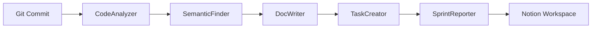
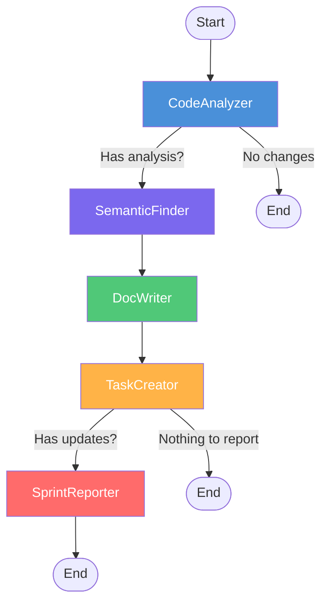

# Codebase Cortex

**Automatically keep your engineering documentation in sync with code.**

Codebase Cortex is a multi-agent system that watches your codebase for changes and updates your Notion documentation automatically. It uses LangGraph to orchestrate five specialized AI agents that analyze code, find related docs, write updates, create tasks, and generate sprint reports — all through the [Notion MCP](https://developers.notion.com/docs/mcp) protocol.



## Features

- **Automatic doc sync** — Commit code, docs update themselves via post-commit hook
- **Section-level updates** — Only changed sections are rewritten, preserving the rest
- **Semantic search** — FAISS embeddings find related code across your entire codebase
- **Natural language prompts** — `cortex prompt "Add more API examples"` to direct updates
- **Multi-page intelligence** — Agents understand relationships across all your doc pages
- **Sprint reports** — Weekly summaries generated from commit activity
- **Task tracking** — Automatically identifies undocumented areas and creates Notion tasks

## Quick Start

### Prerequisites

- Python 3.11+
- [uv](https://docs.astral.sh/uv/) package manager
- A Notion account (free plan works)
- An LLM API key (Google Gemini, Anthropic, or OpenRouter)

### Install

```bash
# Install from source
git clone https://github.com/sarupurisailalith/codebase-cortex.git
cd codebase-cortex
uv sync

# Install globally as a CLI tool
uv tool install .
```

### Initialize in your project

```bash
cd /path/to/your-project

# Interactive setup — connects to Notion, configures LLM, creates starter pages
cortex init

# Run the pipeline
cortex run --once
```

The `init` wizard will:
1. Ask for your LLM provider and API key
2. Open a browser for Notion OAuth authorization
3. Create starter documentation pages in Notion
4. Optionally install a post-commit git hook

## CLI Commands

| Command | Description |
|---------|-------------|
| `cortex init` | Interactive setup wizard |
| `cortex run --once` | Run the full pipeline once |
| `cortex run --once --full` | Full codebase analysis (not just recent diff) |
| `cortex run --once --dry-run` | Analyze without writing to Notion |
| `cortex prompt "instruction"` | Natural language doc updates |
| `cortex prompt "..." -p "Page"` | Target specific page(s) |
| `cortex status` | Show connection and config status |
| `cortex analyze` | One-shot diff analysis (no Notion writes) |
| `cortex embed` | Rebuild the FAISS embedding index |
| `cortex scan` | Discover existing Notion pages |
| `cortex scan --link <id>` | Link a specific Notion page |

## How It Works

Cortex creates a `.cortex/` directory (gitignored) in your project repo that stores configuration, OAuth tokens, and the FAISS vector index. When you run the pipeline, five agents work in sequence:



1. **CodeAnalyzer** — Parses git diffs (or scans the full codebase) and produces a structured analysis of what changed
2. **SemanticFinder** — Embeds the analysis and searches the FAISS index to find semantically related code chunks
3. **DocWriter** — Fetches current Notion pages, generates section-level updates, and merges them deterministically
4. **TaskCreator** — Identifies undocumented areas and creates task pages in Notion
5. **SprintReporter** — Synthesizes all activity into a weekly sprint summary

## Architecture

For detailed architecture documentation, see [`docs/architecture.md`](docs/architecture.md).

## Per-Repo Configuration

```
your-project/
├── .cortex/                    # Created by cortex init (gitignored)
│   ├── .env                    # LLM provider, API keys
│   ├── .gitignore              # Ignores everything in .cortex/
│   ├── notion_tokens.json      # OAuth tokens (auto-refreshed)
│   ├── page_cache.json         # Tracked Notion pages
│   └── faiss_index/            # Vector embeddings
│       ├── index.faiss
│       └── chunks.json
├── src/
└── ...
```

## Supported LLM Providers

| Provider | Models | Config Key |
|----------|--------|------------|
| Google Gemini | gemini-2.5-flash-lite, gemini-3-flash-preview, gemini-2.5-pro | `GOOGLE_API_KEY` |
| Anthropic | claude-sonnet-4, claude-haiku-4.5 | `ANTHROPIC_API_KEY` |
| OpenRouter | Any model via OpenRouter | `OPENROUTER_API_KEY` |

## Documentation

| Document | Description |
|----------|-------------|
| [Architecture](docs/architecture.md) | System design, data flow, agent pipeline |
| [CLI Reference](docs/cli-reference.md) | All commands, options, and examples |
| [Agents](docs/agents.md) | How each agent works |
| [Configuration](docs/configuration.md) | Setup, LLM providers, environment variables |
| [Notion Integration](docs/notion-integration.md) | OAuth flow, MCP protocol, page management |
| [Embeddings & Search](docs/embeddings.md) | FAISS index, semantic search, HDBSCAN clustering |
| [Contributing](docs/contributing.md) | Development setup, testing, project structure |

## License

MIT
