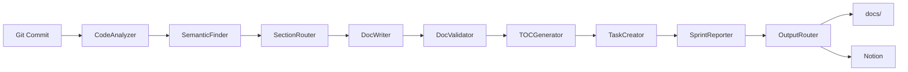
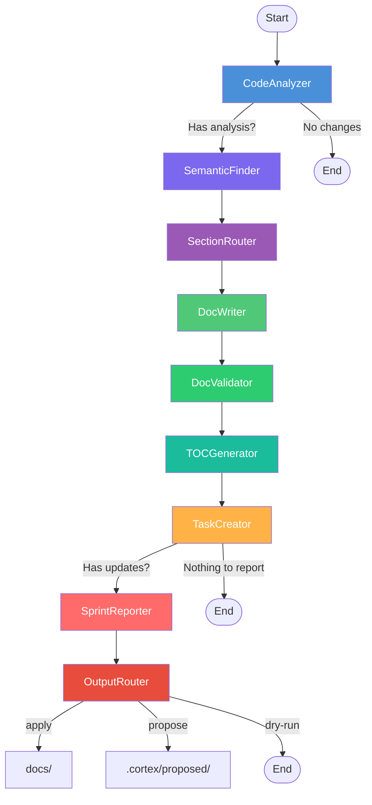

# Codebase Cortex

[](https://pypi.org/project/codebase-cortex/)
[](https://pypi.org/project/codebase-cortex/)
[](https://opensource.org/licenses/MIT)
[](https://pypi.org/project/codebase-cortex/)

**Automatically keep your engineering documentation in sync with code.**

Codebase Cortex is a local-first, multi-agent documentation engine that watches your codebase for changes and updates markdown documentation automatically. It uses LangGraph to orchestrate nine pipeline nodes that analyze code, route updates to specific sections, write docs, validate accuracy, generate indexes, create tasks, and produce sprint reports. Docs live as plain markdown files in your repo — no cloud dependency required. Optional sync to Notion is available via the DocBackend protocol.



## Features

- **Local-first documentation** — Docs are plain markdown in your repo's `docs/` directory. No cloud dependency required
- **Section-level updates** — Only changed sections are rewritten, preserving human edits
- **Human-edit preservation** — MetaIndex tracks section hashes and detects manual edits, which the pipeline protects
- **Semantic search** — FAISS embeddings with TreeSitter-aware AST chunking find related code across your entire codebase
- **Incremental indexing** — Only re-embeds changed files, with `.cortexignore` for custom exclusions
- **Draft banners** — New pages are marked as drafts until reviewed; remove with `cortex accept`
- **Multi-backend output** — DocBackend protocol with LocalMarkdownBackend (default) and NotionBackend
- **Output modes** — `apply` writes directly, `propose` stages for review, `dry-run` previews only
- **Sprint reports** — Weekly summaries generated from commit activity with run metrics
- **Task tracking** — Automatically identifies undocumented areas and creates tasks
- **Cost tracking** — Run metrics aggregate token usage, wall-clock time, and cost per pipeline run
- **CI/CD integration** — `cortex ci` command outputs structured JSON for GitHub Actions and GitLab CI pipelines (PR impact analysis, post-merge doc updates)

## Quick Start

### Prerequisites

- Python 3.11+
- [uv](https://docs.astral.sh/uv/) package manager
- An LLM — cloud API key (Gemini, Anthropic, OpenRouter, OpenAI) or a local model (Ollama, vLLM, LM Studio)

### Install

```bash
# Install from PyPI
pip install codebase-cortex

# Or with uv
uv tool install codebase-cortex
```

Both `cortex` and `codebase-cortex` commands are available after installation. If `cortex` conflicts with another package on your system, use `codebase-cortex` instead.

<details>
<summary>Install from source</summary>

```bash
git clone https://github.com/sarupurisailalith/codebase-cortex.git
cd codebase-cortex
uv sync
uv tool install .
```
</details>

### Initialize in your project

```bash
cd /path/to/your-project

# Interactive setup — configures LLM, creates docs/ directory
cortex init

# Quick setup with defaults
cortex init --quick

# Run the pipeline
cortex run --once
```

The `init` wizard will:
1. Ask for your LLM provider and API key
2. Create a `.cortex/` config directory and `docs/` output directory
3. Optionally connect to Notion via OAuth
4. Optionally install a post-commit git hook

## CLI Commands

| Command | Description |
|---------|-------------|
| `cortex init [--quick]` | Interactive setup wizard |
| `cortex run --once [--full] [--dry-run]` | Run the full pipeline once |
| `cortex status` | Show connection and config status |
| `cortex analyze` | One-shot diff analysis (no doc writes) |
| `cortex embed` | Rebuild the FAISS embedding index |
| `cortex config show` | Display current configuration |
| `cortex config set KEY VALUE` | Update a config value |
| `cortex diff` | Show proposed documentation changes |
| `cortex apply` | Apply proposed changes to `docs/` |
| `cortex discard` | Discard proposed changes |
| `cortex accept` | Remove draft banners after review |
| `cortex resolve` | Resolve merge conflicts in `docs/` |
| `cortex check` | Check documentation freshness |
| `cortex sync --target notion` | Sync local docs to Notion (OAuth flow) |
| `cortex ci [--on-pr] [--on-merge]` | CI/CD mode (JSON output for pipelines) |
| `cortex map` | Generate knowledge map from FAISS clusters |

## How It Works

Cortex creates a `.cortex/` directory (gitignored) in your project repo that stores configuration, OAuth tokens, and the FAISS vector index. Documentation is written as markdown files to `docs/`. When you run the pipeline, nine nodes work in sequence:



1. **CodeAnalyzer** — Parses git diffs (or scans the full codebase) and produces a structured analysis of what changed
2. **SemanticFinder** — Incrementally embeds changed files using TreeSitter AST chunking and searches the FAISS index for semantically related code
3. **SectionRouter** — Reads `INDEX.md` and `.cortex-meta.json` to triage which sections in which pages need updating, respecting human-edited sections
4. **DocWriter** — Reads only targeted sections by line range, generates updated content, and writes via the DocBackend protocol
5. **DocValidator** — Compares generated docs against actual code for factual accuracy, flagging low-confidence sections for human review
6. **TOCGenerator** — Regenerates TOC markers in updated files, refreshes `INDEX.md` and `.cortex-meta.json`, records run metrics
7. **TaskCreator** — Identifies documentation gaps and creates task entries
8. **SprintReporter** — Synthesizes all activity into a weekly sprint summary with run metrics
9. **OutputRouter** — Applies the configured output mode (apply, propose, or dry-run)

## Per-Repo Configuration

```
your-project/
├── .cortex/                    # Created by cortex init (gitignored)
│   ├── .env                    # LLM model, API keys, doc settings
│   ├── .gitignore              # Ignores everything in .cortex/
│   ├── .cortexignore           # User-defined FAISS indexing exclusions
│   ├── notion_tokens.json      # OAuth tokens (if Notion connected)
│   ├── page_cache.json         # Tracked Notion pages (if connected)
│   ├── proposed/               # Staged changes (propose mode)
│   └── faiss_index/            # Vector embeddings
│       ├── index.faiss
│       ├── chunks.json
│       ├── id_map.json
│       └── file_hashes.json
├── docs/                       # Generated documentation (local backend)
│   ├── INDEX.md                # Auto-generated index with heading tree
│   ├── .cortex-meta.json       # Section hashes, human-edit tracking
│   └── *.md                    # Documentation pages
└── src/
```

## Supported LLM Providers

Cortex uses [LiteLLM](https://docs.litellm.ai/) as a unified LLM interface. **Any LiteLLM-compatible model works** — cloud APIs, local models, or self-hosted endpoints. LiteLLM supports [100+ providers](https://docs.litellm.ai/docs/providers).

| Provider | Example Model | Config |
|----------|---------------|--------|
| Google Gemini | `gemini/gemini-2.5-flash-lite` | `GOOGLE_API_KEY` |
| Anthropic | `anthropic/claude-sonnet-4-20250514` | `ANTHROPIC_API_KEY` |
| OpenRouter | `openrouter/google/gemini-2.5-flash-lite` | `OPENROUTER_API_KEY` |
| Ollama (local) | `ollama/llama3` | No key needed (runs locally) |
| vLLM (local) | `hosted_vllm/model-name` | `LLM_API_BASE=http://localhost:8000` |
| LM Studio | `lm_studio/model-name` | `LLM_API_BASE=http://localhost:1234/v1` |
| OpenAI | `gpt-4o` | `OPENAI_API_KEY` |
| Azure OpenAI | `azure/gpt-4o` | `AZURE_API_KEY` + `AZURE_API_BASE` |

For local models, set the model name and optionally `LLM_API_BASE` in `.cortex/.env`:

```env
LLM_MODEL=ollama/llama3
# or
LLM_MODEL=hosted_vllm/my-model
LLM_API_BASE=http://localhost:8000
```

## Documentation

| Document | Description |
|----------|-------------|
| [Architecture](docs/architecture.md) | System design, data flow, pipeline nodes |
| [CLI Reference](docs/cli-reference.md) | All commands, options, and examples |
| [Agents](docs/agents.md) | How each pipeline node works |
| [Configuration](docs/configuration.md) | Setup, LLM providers, environment variables |
| [Notion Integration](docs/notion-integration.md) | OAuth flow, sync protocol, page management |
| [Embeddings & Search](docs/embeddings.md) | FAISS index, TreeSitter chunking, semantic search |
| [CI/CD Integration](docs/ci-cd.md) | GitHub Actions, GitLab CI, branch strategies |
| [Contributing](docs/contributing.md) | Development setup, testing, project structure |

## Changelog

### 0.2.0
- **Redesign**: Local-first multi-backend documentation engine — docs live as markdown in `docs/`, no cloud dependency required
- **Pipeline**: 9-node LangGraph pipeline with conditional routing (added SectionRouter, DocValidator, TOCGenerator, OutputRouter)
- **LLM**: LiteLLM unified interface replaces all langchain LLM providers
- **Backends**: DocBackend protocol with LocalMarkdownBackend (default) and NotionBackend
- **Embeddings**: TreeSitter AST-aware code chunking with regex fallback; incremental FAISS index rebuild (only re-embeds changed files)
- **MetaIndex**: `.cortex-meta.json` tracks section hashes and detects human edits for preservation
- **Exclusions**: `.cortexignore` for user-defined FAISS indexing exclusions
- **CLI**: 11 new commands (`config`, `diff`, `apply`, `discard`, `accept`, `resolve`, `check`, `sync`, `map`, and more)
- **Output modes**: `apply` (default), `propose` (staged for review), `dry-run` (preview only)
- **Draft banners**: New pages marked as drafts until reviewed with `cortex accept`
- **Metrics**: Run metrics aggregation (token usage, cost, timing) via LangGraph state reducer
- **Branches**: Branch strategy enforcement (main-only or branch-aware)
- **OAuth**: Service connection pattern for Notion OAuth integration

### 0.1.4
- **Fix**: Resolved duplicate child pages caused by emoji title mismatch between Notion and local cache
- **Fix**: DocWriter now uses normalized title matching for section-level merges (prevents creating duplicates when LLM returns titles with/without emoji)
- **Fix**: Parent page creation now warns user to verify page location in Notion workspace

### 0.1.3
- **Fix**: API key input is now masked during `cortex init`
- **Fix**: Sprint Log uses `replace_content` instead of appending on every run

### 0.1.2
- **Fix**: Dynamic parent page title (uses repo directory name instead of hardcoded "Codebase Cortex")
- **Fix**: Child page bootstrap only checks local cache, no longer adopts unrelated workspace pages

### 0.1.1
- Initial public release

## License

MIT
