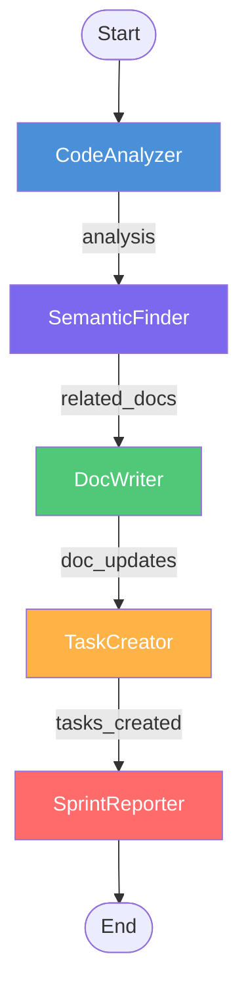
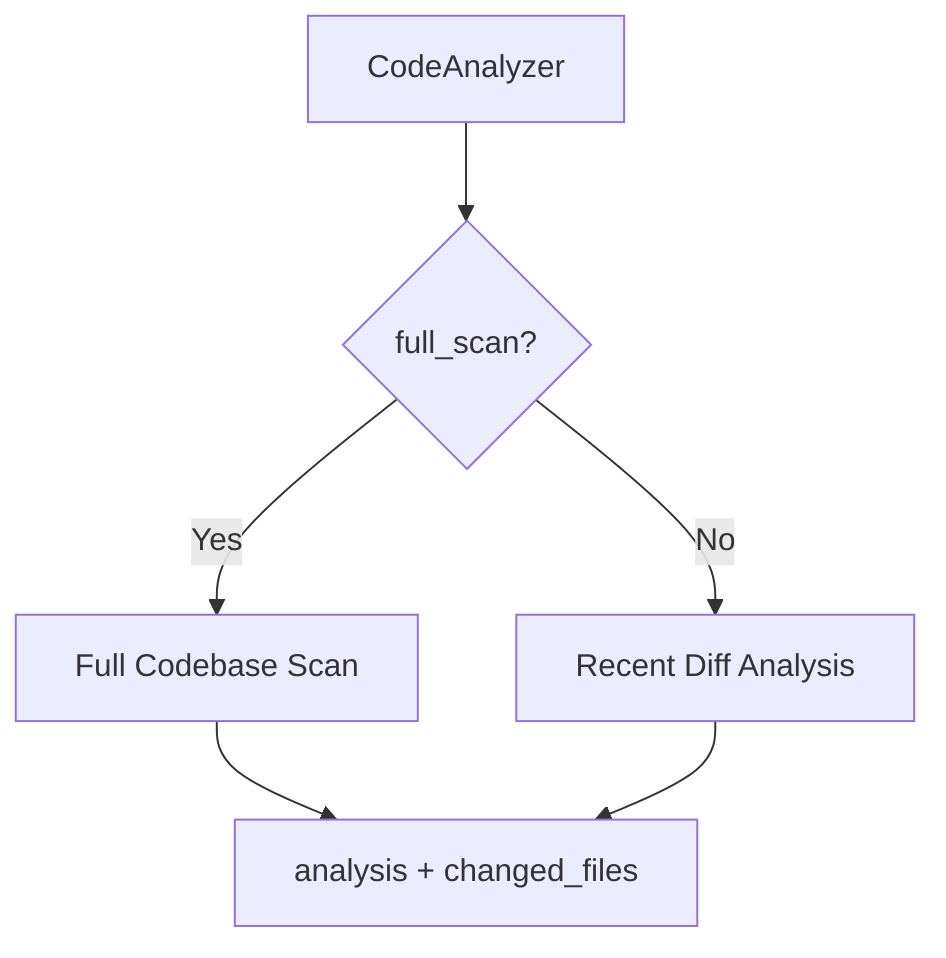
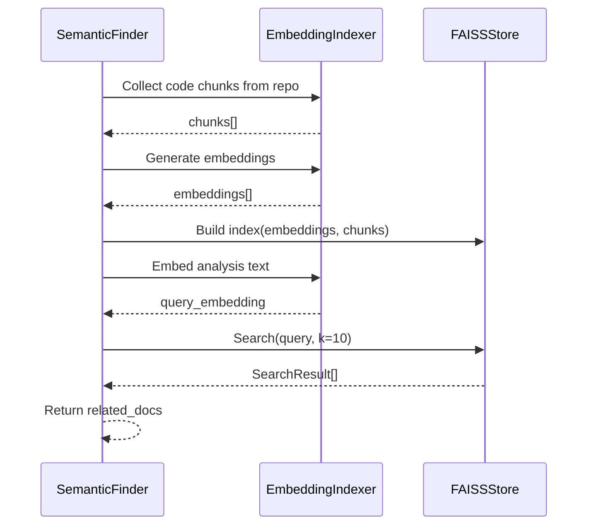
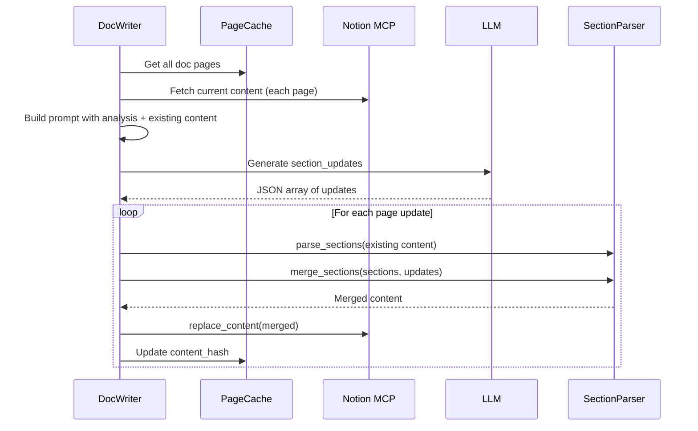
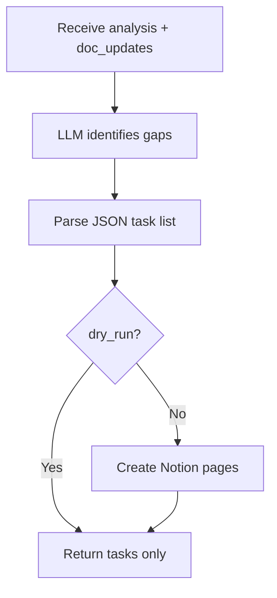
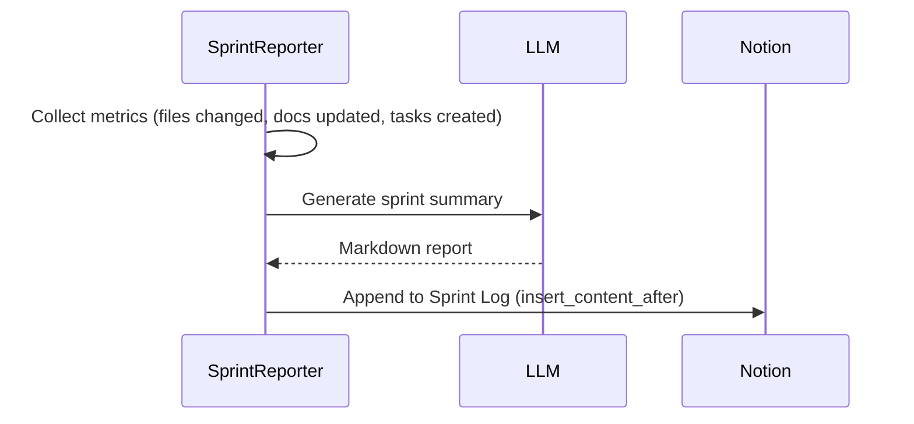

# Agents

Codebase Cortex uses five specialized agents that run in sequence. Each agent reads from and writes to a shared `CortexState` that flows through the LangGraph pipeline.

## Agent Pipeline



All agents extend `BaseAgent`, which provides:
- LLM invocation with logging (`_invoke_llm`)
- Error collection (`_append_error`)
- Handling of structured content blocks from models like Gemini 3

---

## CodeAnalyzer

**File:** `src/codebase_cortex/agents/code_analyzer.py`

Analyzes code changes or the full codebase and produces a structured summary for downstream agents.

### Two modes



| Mode | Trigger | Input | Behavior |
|------|---------|-------|----------|
| **Diff mode** | Default | Recent git commit | Parses the last commit's diff, sends to LLM |
| **Full scan** | `--full` flag or first run | Entire codebase | Walks all source files, builds summary, sends to LLM |

### LLM prompts

**Diff mode** asks the LLM to produce:
- Summary of changes
- List of affected components
- Impact assessment (breaking changes, dependencies)
- Documentation update recommendations

**Full scan mode** asks the LLM to produce:
- Project overview and purpose
- Component inventory with descriptions
- API contracts and interfaces
- Architecture patterns
- Documentation recommendations

### State output

| Field | Type | Description |
|-------|------|-------------|
| `diff_text` | `str` | Raw diff text |
| `changed_files` | `list[FileChange]` | Structured file changes (path, status, additions, deletions) |
| `analysis` | `str` | LLM-generated analysis |

### Implementation details

- Large diffs are truncated to 15,000 characters for LLM context
- Full scan truncates to the first 200 lines per file
- Full scan output is capped at ~50,000 characters total

---

## SemanticFinder

**File:** `src/codebase_cortex/agents/semantic_finder.py`

Finds code chunks that are semantically related to the current analysis using FAISS vector similarity.

### Workflow



1. **Collect** — Walks the repo and extracts code chunks (functions, classes, modules)
2. **Embed** — Generates 384-dimensional embeddings using sentence-transformers
3. **Index** — Builds a FAISS IndexFlatL2 with all chunks
4. **Search** — Embeds the CodeAnalyzer's output and finds the top-10 most similar chunks
5. **Return** — Converts results to `RelatedDoc` entries with similarity scores

### State output

| Field | Type | Description |
|-------|------|-------------|
| `related_docs` | `list[RelatedDoc]` | Related code chunks with similarity scores and content preview |

### Why rebuild every time?

The FAISS index is rebuilt on each pipeline run to capture newly added or modified files since the last run. This ensures the semantic search always reflects the current state of the codebase.

---

## DocWriter

**File:** `src/codebase_cortex/agents/doc_writer.py`

Updates or creates Notion documentation pages based on code analysis. Uses section-level merging to preserve unchanged content.

### Workflow



### Section-level updates

Instead of rewriting entire pages, DocWriter:

1. **Parses** the existing page into sections (split by markdown headings)
2. **Asks the LLM** to return only the sections that changed
3. **Merges** changed sections into the existing structure deterministically
4. **Writes** the full merged content back to Notion

This preserves unchanged sections exactly as-is and prevents LLM drift.

### LLM output format

The LLM returns a JSON array where each element is either:

**Update an existing page:**
```json
{
  "title": "API Reference",
  "action": "update",
  "section_updates": [
    {
      "heading": "## API Endpoints",
      "content": "Updated content here...",
      "action": "update"
    },
    {
      "heading": "## Error Handling",
      "content": "New section content...",
      "action": "create"
    }
  ]
}
```

**Create a new page:**
```json
{
  "title": "New Feature Guide",
  "action": "create",
  "content": "Full markdown content..."
}
```

### Section matching

Headings are matched case-insensitively with `#` symbols stripped:
- `"## API Endpoints"` matches `"## api endpoints"`
- Original heading formatting is preserved

### Notion MCP encoding

The Notion MCP server returns page content with literal `\n` (two-character sequences) instead of real newlines. DocWriter handles this with `_unescape_notion_text()` before parsing.

### State output

| Field | Type | Description |
|-------|------|-------------|
| `doc_updates` | `list[DocUpdate]` | Pages updated or created (page_id, title, content, action) |

---

## TaskCreator

**File:** `src/codebase_cortex/agents/task_creator.py`

Identifies undocumented areas and creates task pages in Notion.

### Workflow



1. **Analyze** — LLM receives the code analysis and list of doc updates already made
2. **Identify gaps** — LLM finds areas not yet covered by documentation
3. **Generate tasks** — Returns JSON array of tasks with title, description, and priority
4. **Create in Notion** — Creates task pages under the "Task Board" parent page

### Task format

Tasks are created as Notion pages with priority icons in the title:

| Priority | Icon | Example |
|----------|------|---------|
| High | 🔴 | 🔴 Document authentication flow |
| Medium | 🟡 | 🟡 Add API endpoint examples |
| Low | 🟢 | 🟢 Update README badges |

### State output

| Field | Type | Description |
|-------|------|-------------|
| `tasks_created` | `list[TaskItem]` | Tasks with title, description, priority |

---

## SprintReporter

**File:** `src/codebase_cortex/agents/sprint_reporter.py`

Generates a weekly sprint summary from all pipeline activity and appends it to the Sprint Log page in Notion.

### Workflow



### Report sections

The LLM generates a sprint summary with:

- **Sprint Overview** — High-level summary of what happened
- **Key Changes** — Most significant code changes
- **Documentation Updates** — Pages updated or created
- **Open Tasks** — Outstanding documentation work
- **Metrics** — Files changed, additions, deletions

### Notion integration

The sprint report is appended to the existing "Sprint Log" page using `insert_content_after`, preserving previous sprint entries. Each report includes a week label (e.g., "Week of March 10, 2026").

### State output

| Field | Type | Description |
|-------|------|-------------|
| `sprint_summary` | `str` | Markdown sprint report |
