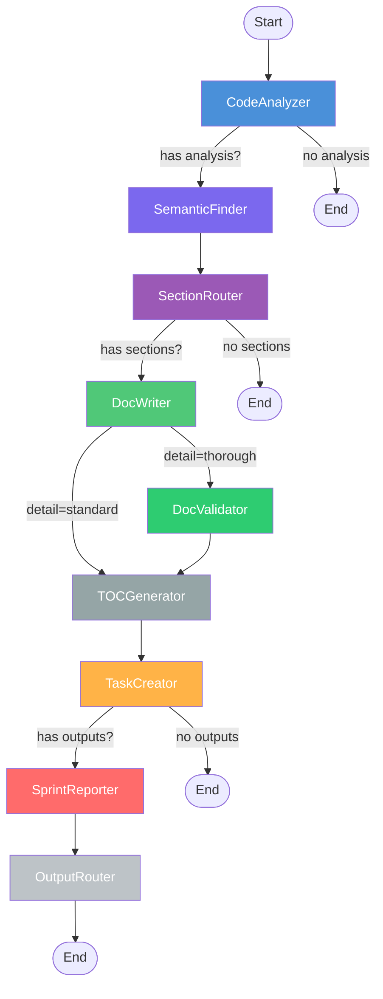
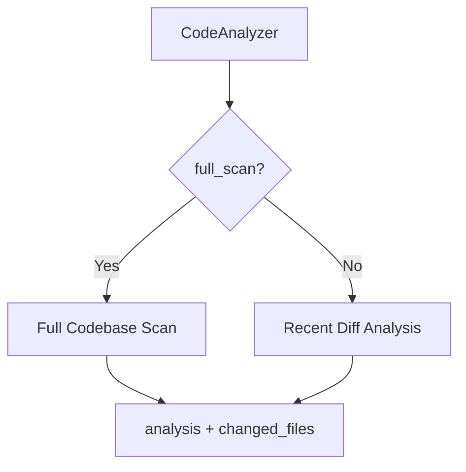
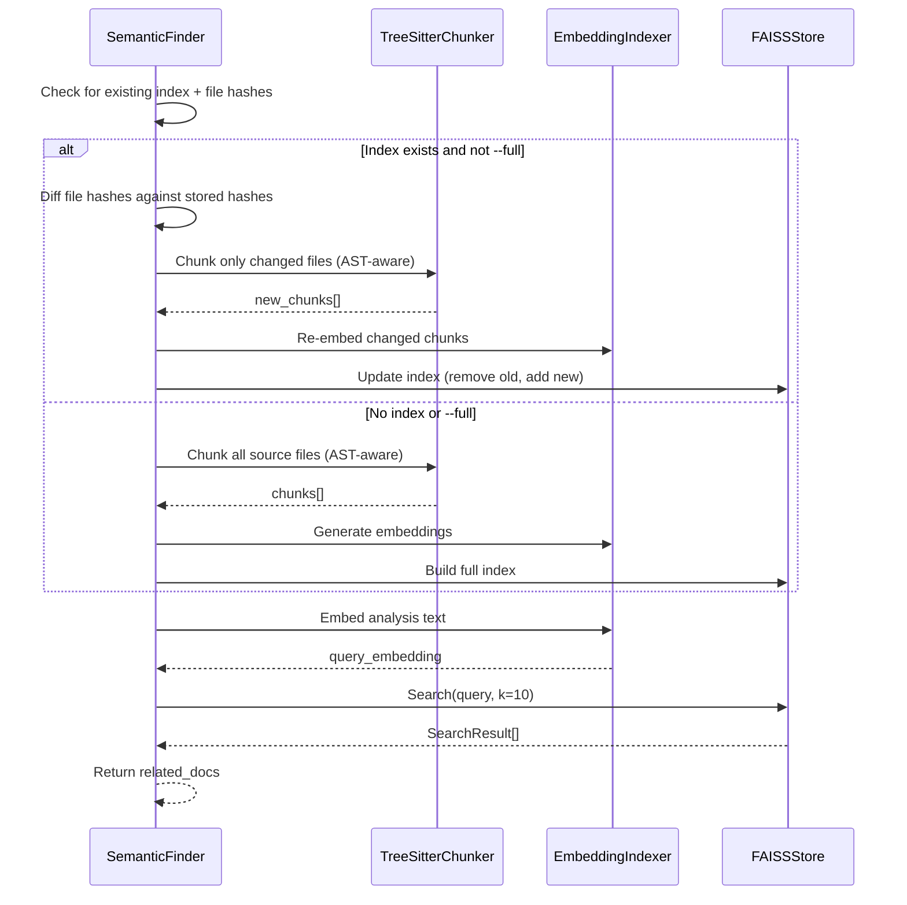
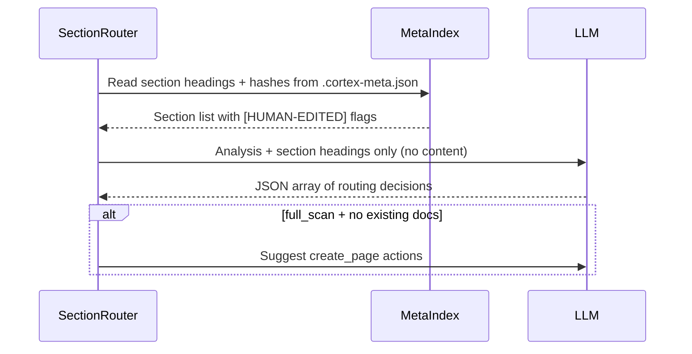
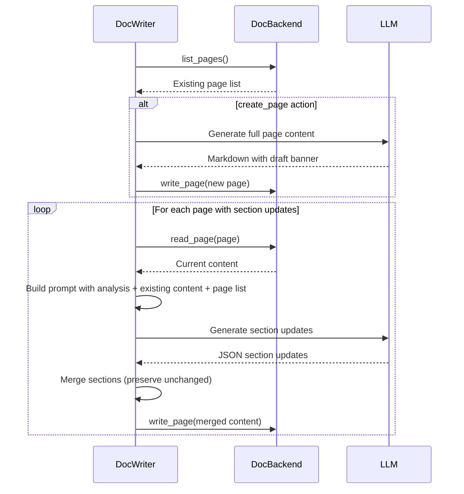
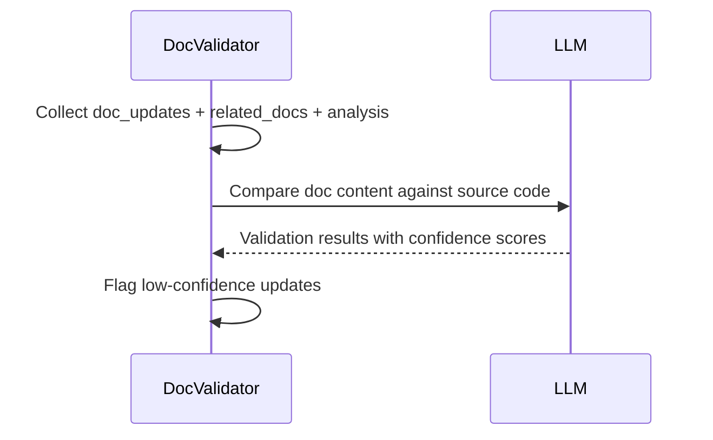
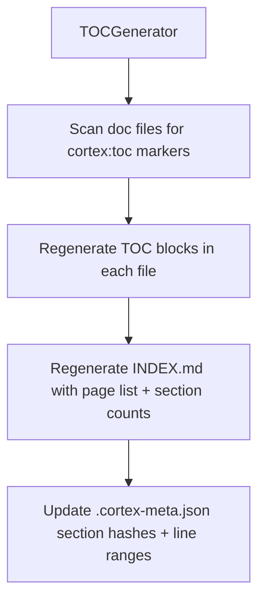
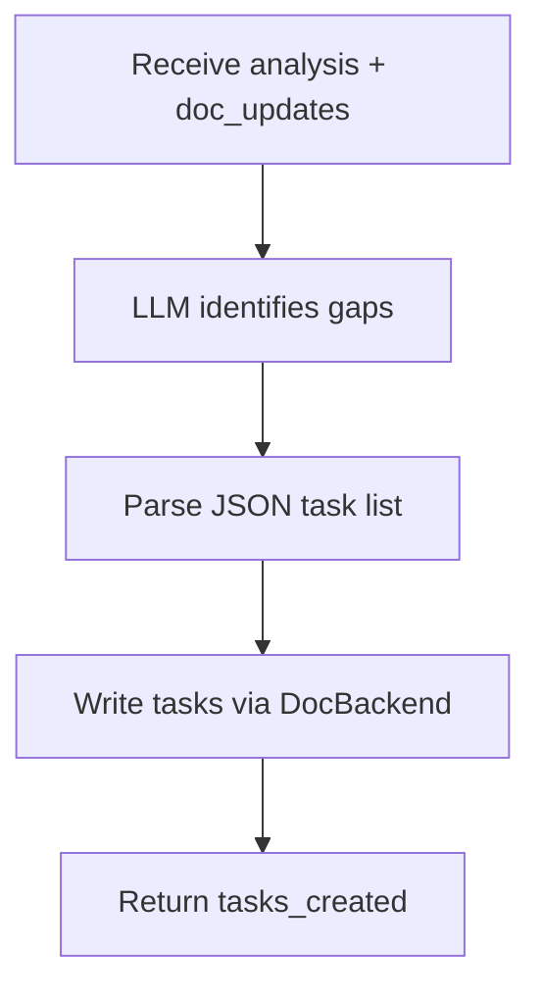
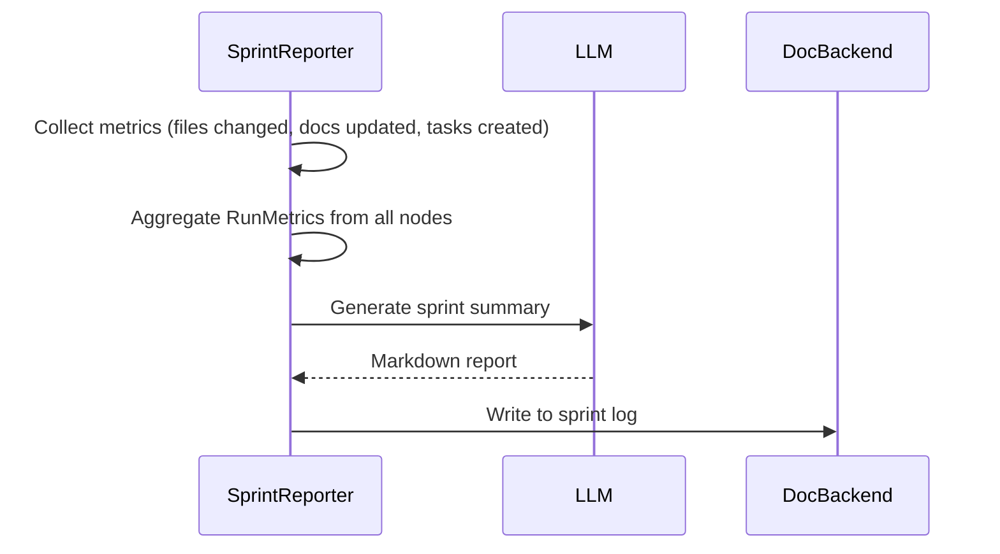

# Agents


<!-- cortex:toc -->
- [Pipeline Overview](#pipeline-overview)
  - [Pipeline flow](#pipeline-flow)
  - [BaseAgent (v0.2)](#baseagent-v02)
  - [Conditional edges](#conditional-edges)
- [CodeAnalyzer](#codeanalyzer)
  - [Two modes](#two-modes)
  - [LLM prompts](#llm-prompts)
  - [State output](#state-output)
  - [Implementation details](#implementation-details)
- [SemanticFinder](#semanticfinder)
  - [Incremental indexing](#incremental-indexing)
  - [Workflow](#workflow)
  - [State output](#state-output-1)
- [SectionRouter](#sectionrouter)
  - [Workflow](#workflow-1)
  - [Routing decisions](#routing-decisions)
  - [Human-edit detection](#human-edit-detection)
  - [State output](#state-output-2)
- [DocWriter](#docwriter)
  - [Workflow](#workflow-2)
  - [DocBackend protocol](#docbackend-protocol)
  - [Section-level updates](#section-level-updates)
  - [LLM output format](#llm-output-format)
  - [Human-edited section handling](#human-edited-section-handling)
  - [State output](#state-output-3)
- [DocValidator](#docvalidator)
  - [Workflow](#workflow-3)
  - [Confidence scoring](#confidence-scoring)
  - [State output](#state-output-4)
- [TOCGenerator](#tocgenerator)
  - [Workflow](#workflow-4)
  - [State output](#state-output-5)
- [TaskCreator](#taskcreator)
  - [Workflow](#workflow-5)
  - [Task format](#task-format)
  - [State output](#state-output-6)
- [SprintReporter](#sprintreporter)
  - [Workflow](#workflow-6)
  - [Report sections](#report-sections)
  - [Run metrics](#run-metrics)
  - [State output](#state-output-7)
- [OutputRouter](#outputrouter)
  - [Routing modes](#routing-modes)
  - [Branch strategy](#branch-strategy)
  - [State output](#state-output-8)
<!-- cortex:toc:end -->

Codebase Cortex v0.2 uses nine pipeline nodes that run in sequence. Seven are LLM-powered agents that extend `BaseAgent`; two are deterministic nodes that require no LLM calls. Each node reads from and writes to a shared `CortexState` that flows through the LangGraph pipeline.

## Pipeline Overview

### Pipeline flow



Nodes with grey styling (TOCGenerator, OutputRouter) are deterministic -- they make no LLM calls.

### BaseAgent (v0.2)

All seven LLM-powered agents extend `BaseAgent`, which provides:

- **LLM invocation via LiteLLM** — `_invoke_llm()` calls `litellm.acompletion()` instead of langchain providers
- **Per-node model selection** — `get_model_for_node()` allows different models for different agents
- **Token and cost tracking** — Each `_invoke_llm()` call records input tokens, output tokens, and cost via `RunMetrics`
- **Fresh metrics per node** — Each graph node creates its own `RunMetrics` instance, returned in state for aggregation
- **Constructor signature** — Accepts `Settings`, optional `DocBackend`, optional `RunMetrics`
- **Error collection** — `_append_error()` for structured error reporting

### Conditional edges

The pipeline has four conditional exits that short-circuit when there is nothing useful to do:

| From | Condition | Target |
|------|-----------|--------|
| CodeAnalyzer | No analysis produced (empty diff, no files) | END |
| SectionRouter | No sections identified for update | END |
| DocWriter | `detail_level == "standard"` | TOCGenerator (skips DocValidator) |
| TaskCreator | No outputs to report | END |

---

## CodeAnalyzer

**File:** `src/codebase_cortex/agents/code_analyzer.py`

Analyzes code changes or the full codebase and produces a structured summary for downstream agents. Unchanged from v0.1.

### Two modes



| Mode | Trigger | Input | Behavior |
|------|---------|-------|----------|
| **Diff mode** | Default | Recent git commit | Parses the last commit's diff, sends to LLM |
| **Full scan** | `--full` flag or first run | Entire codebase | Walks all source files, builds summary, sends to LLM |

### LLM prompts

**Diff mode** asks the LLM to produce:
- Summary of changes
- List of affected components
- Impact assessment (breaking changes, dependencies)
- Documentation update recommendations

**Full scan mode** asks the LLM to produce:
- Project overview and purpose
- Component inventory with descriptions
- API contracts and interfaces
- Architecture patterns
- Documentation recommendations

### State output

| Field | Type | Description |
|-------|------|-------------|
| `diff_text` | `str` | Raw diff text |
| `changed_files` | `list[FileChange]` | Structured file changes (path, status, additions, deletions) |
| `analysis` | `str` | LLM-generated analysis |

### Implementation details

- Large diffs are truncated to 15,000 characters for LLM context
- Full scan truncates to the first 200 lines per file
- Full scan output is capped at ~50,000 characters total

---

## SemanticFinder

**File:** `src/codebase_cortex/agents/semantic_finder.py`

Finds code chunks that are semantically related to the current analysis using FAISS vector similarity. In v0.2, uses incremental indexing and AST-aware chunking.

### Incremental indexing

In v0.1, the FAISS index was rebuilt from scratch on every run. In v0.2, SemanticFinder uses incremental indexing:

1. **Hash comparison** — On subsequent runs, compares file hashes against the stored index
2. **Partial re-embed** — Only re-embeds files whose hashes have changed
3. **TreeSitterChunker** — Uses AST-aware chunking (functions, classes, methods) instead of naive line splits
4. **Full rebuild fallback** — Falls back to a full rebuild if no existing index is found or the `--full` flag is passed

### Workflow



### State output

| Field | Type | Description |
|-------|------|-------------|
| `related_docs` | `list[RelatedDoc]` | Related code chunks with similarity scores and content preview |

---

## SectionRouter

**File:** `src/codebase_cortex/agents/section_router.py`

New in v0.2. Lightweight triage agent that determines which documentation sections need updating without reading full page content.

### Workflow



### Routing decisions

The LLM receives only section headings (not content) and the code analysis, then returns a JSON array:

```json
[
  {
    "page": "Architecture Overview",
    "section": "## Component Graph",
    "reason": "New service added in commit abc123",
    "priority": "high"
  },
  {
    "page": "API Reference",
    "section": "## Endpoints",
    "reason": "Route handler modified",
    "priority": "medium"
  }
]
```

On a `full_scan` with no existing documentation, SectionRouter suggests `create_page` actions instead of section updates.

### Human-edit detection

SectionRouter uses the MetaIndex (`.cortex-meta.json`) to detect sections that have been manually edited by humans since the last Cortex run. These sections are flagged as `[HUMAN-EDITED]` in the heading list sent to the LLM, so downstream agents (DocWriter) can handle them with care.

### State output

| Field | Type | Description |
|-------|------|-------------|
| `routed_sections` | `list[RoutedSection]` | Sections to update with page, heading, reason, and priority |

---

## DocWriter

**File:** `src/codebase_cortex/agents/doc_writer.py`

Updates or creates documentation pages based on routed sections. Major refactor in v0.2: writes through the DocBackend protocol instead of directly to Notion.

### Workflow



### DocBackend protocol

DocWriter no longer talks to Notion directly. It writes through the `DocBackend` protocol, which has two implementations:

| Backend | Storage | Use case |
|---------|---------|----------|
| `LocalMarkdownBackend` | `docs/` directory as markdown files | Local-first, git-tracked docs |
| `NotionBackend` | Notion workspace via MCP | Existing Notion users |

### Section-level updates

Instead of rewriting entire pages, DocWriter:

1. **Receives** routed sections from SectionRouter (only sections that need changes)
2. **Groups** updates by page to minimize backend round-trips
3. **Parses** the existing page into sections (split by markdown headings)
4. **Asks the LLM** to return only the sections that changed
5. **Passes the existing page list** to the LLM to prevent hallucinated cross-links
6. **Merges** changed sections into the existing structure deterministically
7. **Writes** the full merged content back through DocBackend

### LLM output format

The LLM returns a JSON array where each element is either:

**Update an existing page:**
```json
{
  "title": "API Reference",
  "action": "update",
  "section_updates": [
    {
      "heading": "## API Endpoints",
      "content": "Updated content here...",
      "action": "update"
    },
    {
      "heading": "## Error Handling",
      "content": "New section content...",
      "action": "create"
    }
  ]
}
```

**Create a new page (includes draft banner):**
```json
{
  "title": "New Feature Guide",
  "action": "create",
  "content": "> **Draft** — This page was auto-generated by Cortex...\n\nFull markdown content..."
}
```

### Human-edited section handling

When a section is flagged as `[HUMAN-EDITED]` by SectionRouter, DocWriter uses a preservation prompt that instructs the LLM to:
- Keep the human's structure and tone
- Only add or correct factual information based on code changes
- Never rewrite the section from scratch

### State output

| Field | Type | Description |
|-------|------|-------------|
| `doc_updates` | `list[DocUpdate]` | Pages updated or created (page_id, title, content, action) |

---

## DocValidator

**File:** `src/codebase_cortex/agents/doc_validator.py`

New in v0.2. Validates documentation updates against the source code to catch inaccuracies before they are committed. Only runs at "thorough" detail level; skipped at "standard" (conditional edge from DocWriter).

### Workflow



### Confidence scoring

DocValidator assigns a confidence score to each doc update:

| Score | Meaning | Action |
|-------|---------|--------|
| 0.9 -- 1.0 | High confidence, matches source | Pass through |
| 0.7 -- 0.9 | Mostly accurate, minor concerns | Pass with warnings |
| < 0.7 | Low confidence, potential inaccuracy | Flag for review |

### State output

| Field | Type | Description |
|-------|------|-------------|
| `validation_results` | `list[ValidationResult]` | Per-update confidence score and issues found |

---

## TOCGenerator

**File:** `src/codebase_cortex/agents/toc_generator.py`

New in v0.2. Deterministic node (no LLM calls, does not extend BaseAgent). Maintains table-of-contents markers and the documentation meta-index.

### Workflow



1. **TOC markers** — Finds `<!-- cortex:toc -->` and `<!-- cortex:toc:end -->` markers in doc files and regenerates the TOC block between them
2. **INDEX.md** — Regenerates `docs/INDEX.md` with a list of all pages, their sections, and section counts
3. **Meta-index update** — Updates `.cortex-meta.json` with current section hashes and line ranges so that SectionRouter and MetaIndex can detect human edits on the next run

### State output

| Field | Type | Description |
|-------|------|-------------|
| `toc_updated` | `bool` | Whether TOC markers were updated |
| `meta_index_updated` | `bool` | Whether `.cortex-meta.json` was updated |

---

## TaskCreator

**File:** `src/codebase_cortex/agents/task_creator.py`

Identifies undocumented areas and creates tasks. In v0.2, writes through DocBackend (`docs/task-board.md` for local, Notion Task Board page for Notion backend).

### Workflow



1. **Analyze** — LLM receives the code analysis and list of doc updates already made
2. **Identify gaps** — LLM finds areas not yet covered by documentation
3. **Generate tasks** — Returns JSON array of tasks with title, description, and priority
4. **Write via DocBackend** — Creates tasks in `docs/task-board.md` (LocalMarkdownBackend) or under the Notion "Task Board" page (NotionBackend)

### Task format

Tasks are created with priority indicators:

| Priority | Marker | Example |
|----------|--------|---------|
| High | `[P0]` | `[P0] Document authentication flow` |
| Medium | `[P1]` | `[P1] Add API endpoint examples` |
| Low | `[P2]` | `[P2] Update README badges` |

### State output

| Field | Type | Description |
|-------|------|-------------|
| `tasks_created` | `list[TaskItem]` | Tasks with title, description, priority |

---

## SprintReporter

**File:** `src/codebase_cortex/agents/sprint_reporter.py`

Generates a sprint summary from all pipeline activity and writes it through DocBackend. In v0.2, includes run metrics (token usage and cost).

### Workflow



### Report sections

The LLM generates a sprint summary with:

- **Sprint Overview** — High-level summary of what happened
- **Key Changes** — Most significant code changes
- **Documentation Updates** — Pages updated or created
- **Open Tasks** — Outstanding documentation work
- **Metrics** — Files changed, additions, deletions

### Run metrics

New in v0.2. SprintReporter aggregates `RunMetrics` from all agent nodes and includes them in the report:

- Total input and output tokens across all agents
- Per-agent token breakdown
- Estimated cost (based on LiteLLM pricing)
- Model(s) used

### State output

| Field | Type | Description |
|-------|------|-------------|
| `sprint_summary` | `str` | Markdown sprint report including run metrics |

---

## OutputRouter

**File:** `src/codebase_cortex/agents/output_router.py`

New in v0.2. Deterministic node (no LLM calls, does not extend BaseAgent). Routes pipeline output based on the run mode.

### Routing modes

| Mode | Behavior |
|------|----------|
| `apply` | No-op -- DocWriter and other agents have already written through DocBackend |
| `propose` | Copies all doc updates to `.cortex/proposed/` for human review before applying |
| `dry-run` | Logs a summary of what would be changed without writing anything |

### Branch strategy

OutputRouter enforces branch-aware safety rules:

- If the repo is configured with `main_only_apply: true`, running on a non-main branch forces `dry-run` mode regardless of what was requested
- This prevents accidental doc writes from feature branches

### State output

| Field | Type | Description |
|-------|------|-------------|
| `output_mode` | `str` | The mode that was actually used (`apply`, `propose`, or `dry-run`) |
| `proposed_path` | `str \| None` | Path to proposed output directory (only in `propose` mode) |
