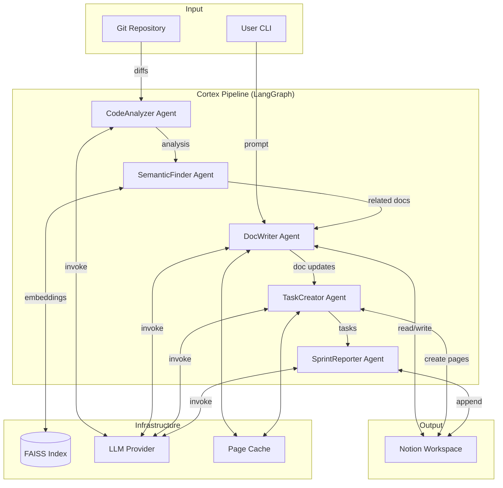
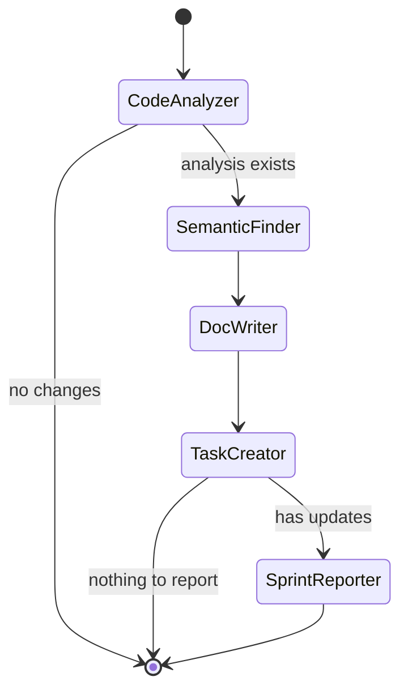
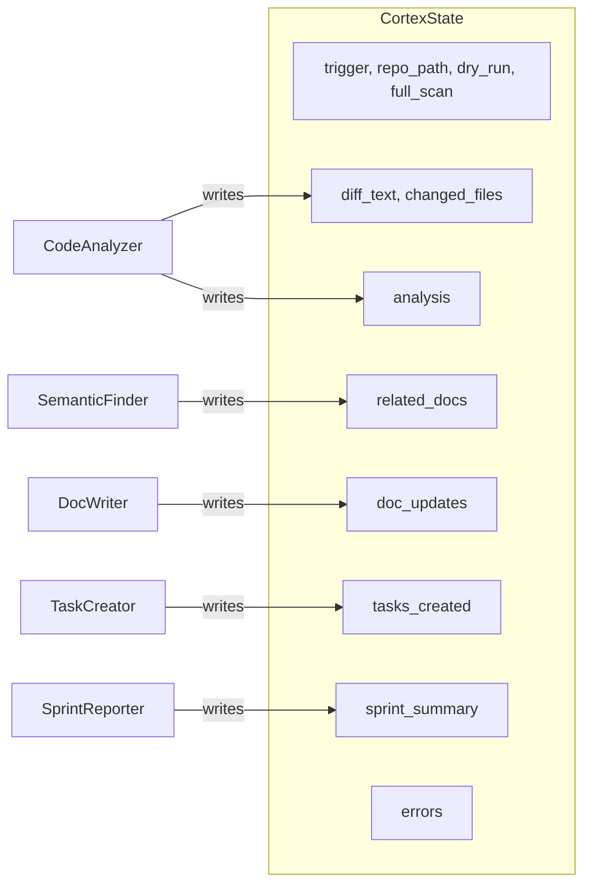
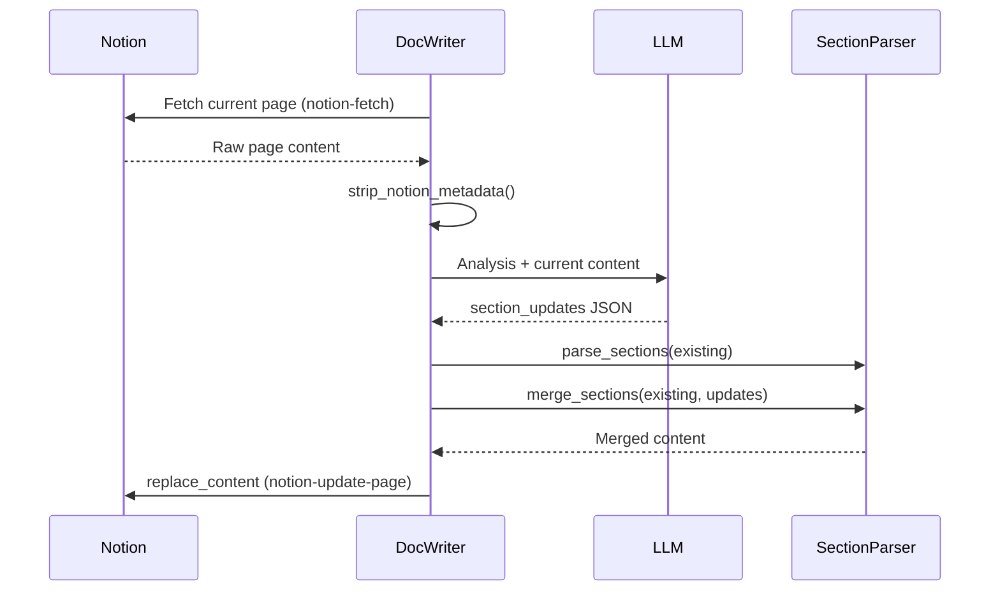
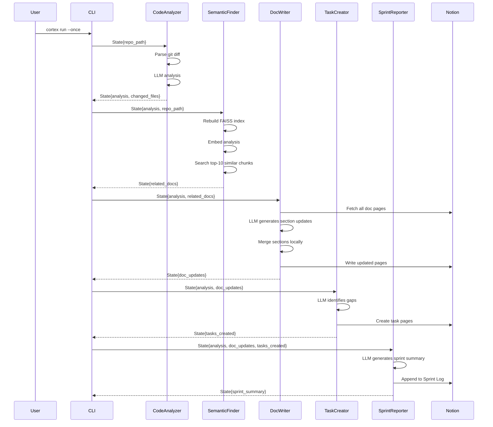
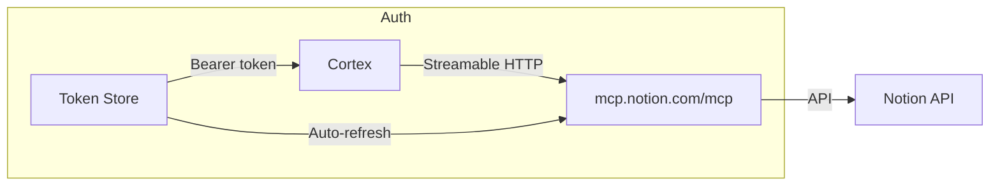

# Architecture

Codebase Cortex is a multi-agent pipeline built on [LangGraph](https://langchain-ai.github.io/langgraph/) that connects a git repository to a Notion workspace via the [Notion MCP](https://developers.notion.com/docs/mcp) protocol.

## System Overview



## Agent Pipeline

The pipeline is orchestrated by a LangGraph `StateGraph`. All agents share a single `CortexState` TypedDict that flows through the graph:



### Conditional routing

The graph includes two conditional edges:

1. **After CodeAnalyzer**: If no `analysis` was produced (no code changes detected), the pipeline ends early.
2. **After TaskCreator**: If neither `doc_updates` nor `tasks_created` have content, the pipeline skips SprintReporter.

## Shared State

All agents read from and write to a shared `CortexState` TypedDict:



| Field | Type | Set By |
|-------|------|--------|
| `trigger` | `str` | CLI (commit/pr/schedule/manual) |
| `repo_path` | `str` | CLI |
| `dry_run` | `bool` | CLI |
| `full_scan` | `bool` | CLI |
| `diff_text` | `str` | CodeAnalyzer |
| `changed_files` | `list[FileChange]` | CodeAnalyzer |
| `analysis` | `str` | CodeAnalyzer |
| `related_docs` | `list[RelatedDoc]` | SemanticFinder |
| `doc_updates` | `list[DocUpdate]` | DocWriter |
| `tasks_created` | `list[TaskItem]` | TaskCreator |
| `sprint_summary` | `str` | SprintReporter |
| `errors` | `list[str]` | Any agent |

## Section-Level Document Updates

DocWriter uses a deterministic merge strategy to update only changed sections of a page, rather than rewriting entire documents:



1. **Fetch** — Current page content retrieved from Notion via MCP
2. **Analyze** — LLM receives the analysis and current page content, returns only changed sections
3. **Parse** — Existing content is parsed into sections by markdown headings
4. **Merge** — Changed sections replace their corresponding headings; new sections are appended
5. **Write** — Merged content is written back as a full page replacement

This ensures unchanged sections are preserved exactly, and the LLM only generates content for sections that need updating.

## Data Flow: Full Pipeline Run



## MCP Connection

Cortex connects to Notion through the Model Context Protocol (MCP) using OAuth 2.0 with PKCE:



- **Transport**: Streamable HTTP to `https://mcp.notion.com/mcp`
- **Authentication**: OAuth 2.0 + PKCE with dynamic client registration
- **Rate Limiting**: Dual token bucket (180 req/min general, 30 req/min search)
- **Tools Used**: `notion-fetch`, `notion-update-page`, `notion-create-pages`, `notion-search`

## Project Structure

```
codebase-cortex/
├── src/codebase_cortex/
│   ├── cli.py                    # Click CLI (init, run, status, prompt, etc.)
│   ├── config.py                 # Settings, get_llm() factory
│   ├── state.py                  # CortexState TypedDict
│   ├── graph.py                  # LangGraph StateGraph definition
│   ├── mcp_client.py             # Notion MCP connection
│   ├── agents/
│   │   ├── base.py               # BaseAgent ABC
│   │   ├── code_analyzer.py      # Git diff analysis
│   │   ├── semantic_finder.py    # FAISS similarity search
│   │   ├── doc_writer.py         # Section-level Notion updates
│   │   ├── task_creator.py       # Task page creation
│   │   └── sprint_reporter.py    # Sprint summary generation
│   ├── auth/
│   │   ├── oauth.py              # OAuth 2.0 + PKCE flow
│   │   ├── callback_server.py    # Local HTTP server for OAuth
│   │   └── token_store.py        # Token persistence and refresh
│   ├── embeddings/
│   │   ├── indexer.py            # Code chunking and embedding
│   │   ├── store.py              # FAISS index management
│   │   └── clustering.py         # HDBSCAN topic clustering
│   ├── git/
│   │   ├── diff_parser.py        # Git diff parsing
│   │   └── github_client.py      # GitHub API (optional)
│   ├── notion/
│   │   ├── bootstrap.py          # Starter page creation
│   │   └── page_cache.py         # Page metadata cache
│   └── utils/
│       ├── json_parsing.py       # Robust JSON extraction
│       ├── logging.py            # Rich-based logging
│       ├── rate_limiter.py       # Async token bucket
│       └── section_parser.py     # Markdown section parser
├── tests/                        # pytest test suite
├── docs/                         # Documentation
├── pyproject.toml
└── CLAUDE.md                     # Claude Code instructions
```

## Technology Stack

| Component | Technology | Purpose |
|-----------|-----------|---------|
| Orchestration | LangGraph | Multi-agent pipeline with conditional routing |
| LLM | Google Gemini / Anthropic / OpenRouter | Code analysis, doc generation |
| Embeddings | sentence-transformers (all-MiniLM-L6-v2) | 384-dim code chunk embeddings |
| Vector Search | FAISS (IndexFlatL2) | Similarity search over code chunks |
| Clustering | HDBSCAN | Topic discovery from embeddings |
| Notion | MCP (Streamable HTTP) | Read/write documentation pages |
| Auth | OAuth 2.0 + PKCE | Notion authorization |
| CLI | Click + Rich | Command-line interface |
| Git | GitPython | Diff parsing, commit history |
| HTTP | httpx | Async HTTP for OAuth and MCP |
