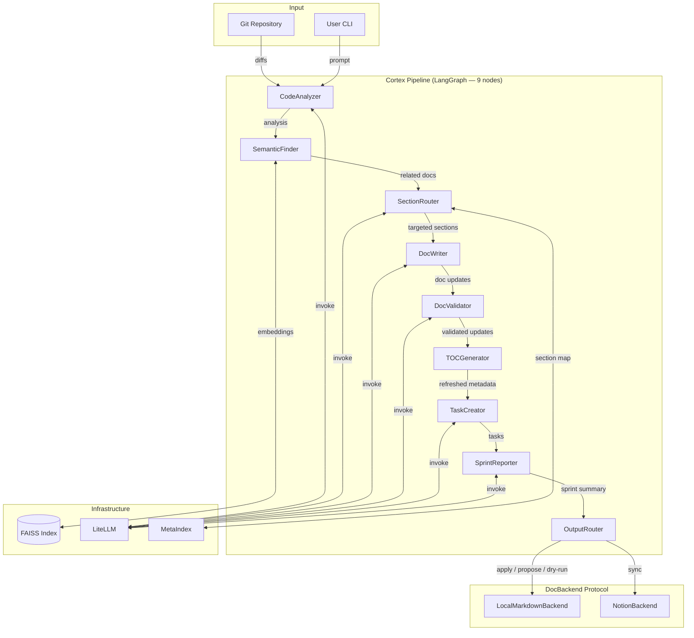
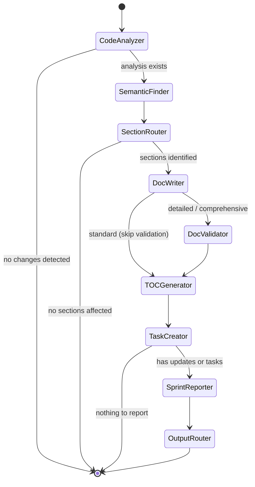
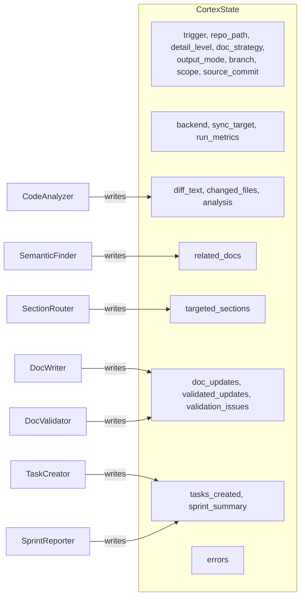
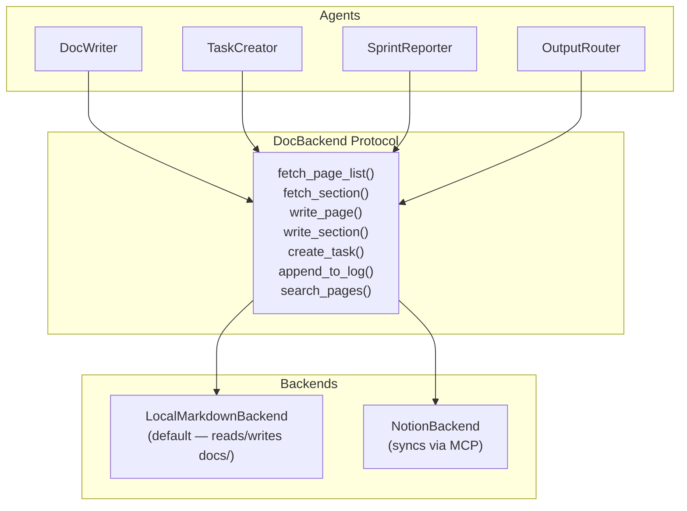
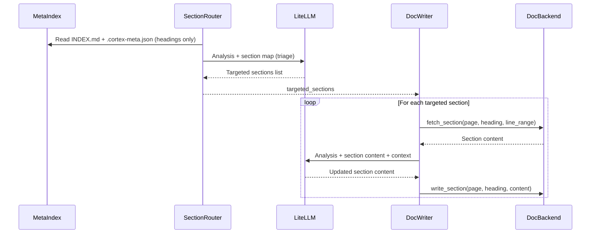
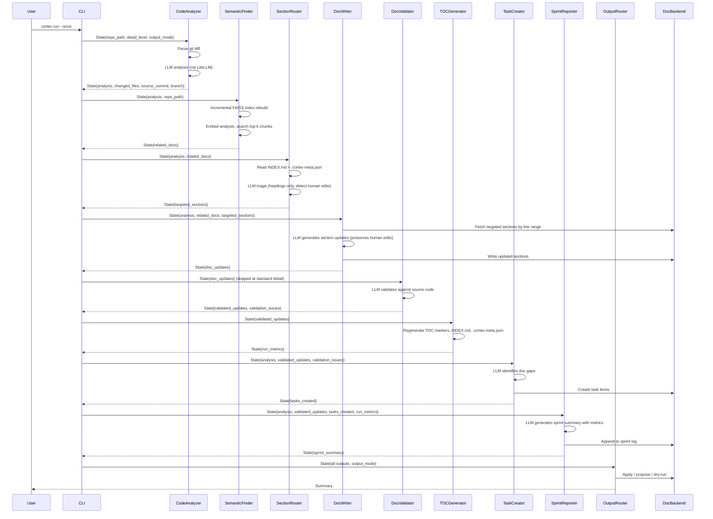
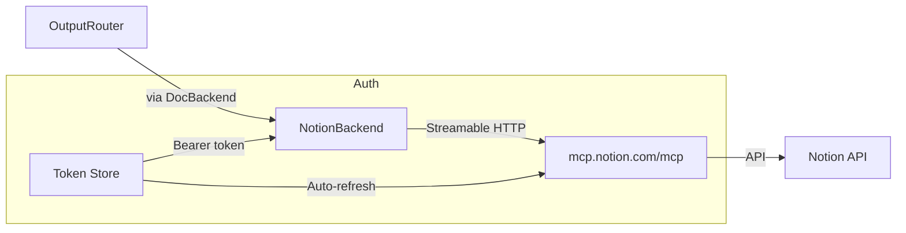

# Architecture


<!-- cortex:toc -->
- [System Overview](#system-overview)
- [Agent Pipeline](#agent-pipeline)
  - [Conditional edges](#conditional-edges)
- [Shared State](#shared-state)
- [DocBackend Protocol](#docbackend-protocol)
- [Section-Level Document Updates](#section-level-document-updates)
  - [Human-edit detection](#human-edit-detection)
- [Output Modes](#output-modes)
- [Data Flow: Full Pipeline Run](#data-flow-full-pipeline-run)
- [Run Metrics](#run-metrics)
- [MCP Connection](#mcp-connection)
- [Project Structure](#project-structure)
- [Technology Stack](#technology-stack)
<!-- cortex:toc:end -->

Codebase Cortex is a local-first, multi-agent documentation engine built on [LangGraph](https://langchain-ai.github.io/langgraph/). It analyzes code changes and keeps engineering documentation in sync — writing to local markdown files by default, with optional sync to external platforms (Notion, etc.) via a pluggable backend protocol.

## System Overview



## Agent Pipeline

The pipeline is orchestrated by a LangGraph `StateGraph` with 9 nodes and 4 conditional edges. All agents share a single `CortexState` TypedDict that flows through the graph:



### Conditional edges

The graph includes four conditional edges:

1. **After CodeAnalyzer** — If no `analysis` was produced (no code changes detected), the pipeline ends early.
2. **After SectionRouter** — If no `targeted_sections` are identified (change is purely internal with no doc impact), the pipeline ends early.
3. **After DocWriter** — At `standard` detail level, DocValidator is skipped (low hallucination risk). At `detailed` or `comprehensive` level, updates flow through DocValidator for accuracy checking.
4. **After TaskCreator** — If neither `validated_updates` nor `tasks_created` have content, the pipeline skips SprintReporter and OutputRouter.

## Shared State

All agents read from and write to a shared `CortexState` TypedDict. Run metrics use a LangGraph `Annotated` reducer so each node's metrics are automatically aggregated.



| Field | Type | Set By |
|-------|------|--------|
| `trigger` | `str` | CLI (commit / pr / schedule / manual) |
| `repo_path` | `str` | CLI |
| `detail_level` | `str` | CLI / config (standard / detailed / comprehensive) |
| `doc_strategy` | `str` | Config (main-only / branch-aware) |
| `output_mode` | `str` | CLI / config (apply / propose / dry-run) |
| `backend` | `DocBackend` | Config / factory |
| `sync_target` | `str` | Config (local / notion) |
| `source_commit` | `str` | CodeAnalyzer |
| `branch` | `str` | CodeAnalyzer |
| `scope` | `str` | CLI (diff / full) |
| `diff_text` | `str` | CodeAnalyzer |
| `changed_files` | `list[FileChange]` | CodeAnalyzer |
| `analysis` | `str` | CodeAnalyzer |
| `related_docs` | `list[RelatedDoc]` | SemanticFinder |
| `targeted_sections` | `list[TargetedSection]` | SectionRouter |
| `doc_updates` | `list[DocUpdate]` | DocWriter |
| `validated_updates` | `list[DocUpdate]` | DocValidator |
| `validation_issues` | `list[ValidationIssue]` | DocValidator |
| `tasks_created` | `list[TaskItem]` | TaskCreator |
| `sprint_summary` | `str` | SprintReporter |
| `run_metrics` | `RunMetrics` | All nodes (Annotated reducer) |
| `errors` | `list[str]` | Any agent |

## DocBackend Protocol

All write operations go through a `DocBackend` protocol. Agents produce structured data; backends handle persistence. This decouples the pipeline from any specific output target.



**LocalMarkdownBackend** (default) reads from and writes to the `docs/` directory in the repository. Section-level reads use line ranges from `.cortex-meta.json` for efficiency. This backend requires no external services and works offline.

**NotionBackend** syncs documentation to a Notion workspace via the Notion MCP protocol. It wraps the existing MCP client and maps DocBackend operations to Notion API calls. Notion becomes a sync target rather than primary storage.

The `get_backend()` factory in `backends/__init__.py` returns the configured backend based on `sync_target` in settings.

## Section-Level Document Updates

DocWriter updates only the specific sections identified by SectionRouter, rather than rewriting entire documents:



1. **Triage** — SectionRouter reads only the documentation structure (headings, not content) and identifies which sections need updating.
2. **Fetch** — DocWriter reads only the targeted sections by line range from the backend.
3. **Generate** — LLM receives the code analysis and current section content, returns updated content for that section only.
4. **Write** — Updated section is spliced back into the page via the backend. Unchanged sections are preserved exactly.

This approach is dramatically more token-efficient than the v0.1 full-page approach (approximately 2,000-3,000 tokens for triage vs. 15,000-30,000 tokens for full-page reads).

### Human-edit detection

The MetaIndex (`.cortex-meta.json`) tracks two hashes per section:

- **`content_hash`** — hash of the section content as it exists on disk.
- **`cortex_hash`** — hash of the content that Cortex last wrote to this section.

When the hashes match, the section is in the state Cortex left it. When they diverge, a human has edited the section since the last Cortex run. SectionRouter flags these sections as `human_edited: true`, and DocWriter adjusts its prompt to preserve manual additions and corrections rather than overwriting them.

## Output Modes

OutputRouter is the final pipeline node and controls how results are delivered:

| Mode | Behavior | Default for |
|------|----------|-------------|
| `apply` | Writes changes directly to `docs/` | Local CLI runs |
| `propose` | Stages to `.cortex/proposed/` (local) or creates a PR branch (CI) | CI runs |
| `dry-run` | Prints a summary of what would change, writes nothing | Non-main branches (main-only strategy) |

The output mode is configurable via `DOC_OUTPUT_MODE` in settings and overridable per-run (`cortex run --once --propose`).

**Branch strategy** controls how Cortex behaves on non-main branches:

- **`main-only`** — Forces `dry-run` on non-main branches. Only main gets doc updates.
- **`branch-aware`** — Allows `apply` on any branch. Section-level granularity minimizes merge conflicts.

## Data Flow: Full Pipeline Run



## Run Metrics

Every pipeline node reports metrics via the `RunMetrics` dataclass. LangGraph's `Annotated` state reducer aggregates metrics automatically as state flows through the graph — each node returns its `NodeMetrics`, and the reducer merges them into the cumulative `RunMetrics`.

Tracked per node:
- Input and output token counts
- Wall-clock time
- Sections read / written / validated

Tracked per run:
- Total tokens and estimated cost
- Pipeline duration
- Sections touched, human-edited sections preserved
- Confidence distribution (from DocValidator)

Metrics are recorded in `.cortex-meta.json` under the `last_run` key and included in sprint summaries.

## MCP Connection

Cortex connects to Notion through the Model Context Protocol (MCP) using OAuth 2.0 with PKCE. In v0.2, MCP calls are encapsulated within `NotionBackend` rather than being called directly by agents.



- **Transport**: Streamable HTTP to `https://mcp.notion.com/mcp`
- **Authentication**: OAuth 2.0 + PKCE with dynamic client registration
- **Rate Limiting**: Dual token bucket (180 req/min general, 30 req/min search)
- **Tools Used**: `notion-fetch`, `notion-update-page`, `notion-create-pages`, `notion-search`

## Project Structure

```
src/codebase_cortex/
├── cli.py                    # Click CLI (init, run, status, config, accept, diff, apply, etc.)
├── config.py                 # Settings dataclass, LiteLLM model routing
├── state.py                  # CortexState TypedDict with Annotated reducers
├── graph.py                  # LangGraph StateGraph (9 nodes, 4 conditional edges)
├── metrics.py                # RunMetrics, NodeMetrics
├── mcp_client.py             # Notion MCP connection
├── agents/
│   ├── base.py               # BaseAgent ABC (LiteLLM invocation)
│   ├── code_analyzer.py      # Git diff / full scan analysis
│   ├── semantic_finder.py    # FAISS similarity search
│   ├── section_router.py     # Section-level triage (new)
│   ├── doc_writer.py         # Section-level doc updates via DocBackend
│   ├── doc_validator.py      # Documentation accuracy validation (new)
│   ├── toc_generator.py      # TOC, INDEX.md, meta index (new, no LLM)
│   ├── task_creator.py       # Task creation
│   ├── sprint_reporter.py    # Sprint summary generation
│   └── output_router.py      # Mode-based delivery (new, no LLM)
├── backends/
│   ├── protocol.py           # DocBackend protocol definition
│   ├── local_markdown.py     # LocalMarkdownBackend (default)
│   ├── notion_backend.py     # NotionBackend
│   ├── meta_index.py         # MetaIndex for section tracking
│   └── __init__.py           # get_backend() factory
├── auth/
│   ├── oauth.py              # OAuth 2.0 + PKCE flow
│   ├── callback_server.py    # Local HTTP server for OAuth
│   └── token_store.py        # Token persistence and refresh
├── embeddings/
│   ├── indexer.py            # Code chunking + embedding + incremental
│   ├── chunker.py            # TreeSitterChunker (new)
│   ├── store.py              # FAISS IndexIDMap management
│   └── clustering.py         # HDBSCAN topic clustering
├── git/
│   ├── diff_parser.py        # Git diff parsing
│   └── github_client.py      # GitHub API (optional)
├── notion/
│   ├── bootstrap.py          # Starter page creation
│   └── page_cache.py         # Page metadata cache
└── utils/
    ├── json_parsing.py       # Robust JSON extraction
    ├── logging.py            # Rich-based logging
    ├── rate_limiter.py       # Async token bucket
    └── section_parser.py     # Markdown section parser
```

## Technology Stack

| Component | Technology | Purpose |
|-----------|-----------|---------|
| Orchestration | LangGraph | Multi-agent pipeline with conditional routing |
| LLM | LiteLLM (unified interface) | Code analysis, doc generation (Google Gemini, Anthropic, OpenRouter, any provider) |
| Embeddings | sentence-transformers (all-MiniLM-L6-v2) | 384-dim code chunk embeddings |
| Code Chunking | tree-sitter (AST-aware) | Language-aware chunking with regex fallback |
| Vector Search | FAISS (IndexIDMap wrapping IndexFlatL2) | Similarity search over code chunks |
| Clustering | HDBSCAN | Topic discovery from embeddings |
| Local Backend | Markdown files in docs/ | Default storage with MetaIndex tracking |
| Notion | MCP (Streamable HTTP) via NotionBackend | Optional sync to Notion workspace |
| Auth | OAuth 2.0 + PKCE | Notion authorization |
| CLI | Click + Rich | Command-line interface |
| Git | GitPython | Diff parsing, commit history |
| HTTP | httpx | Async HTTP for OAuth and MCP |
