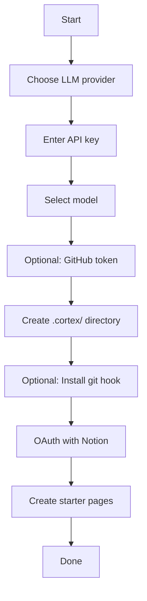
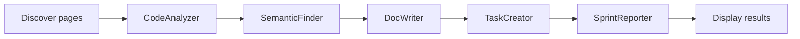
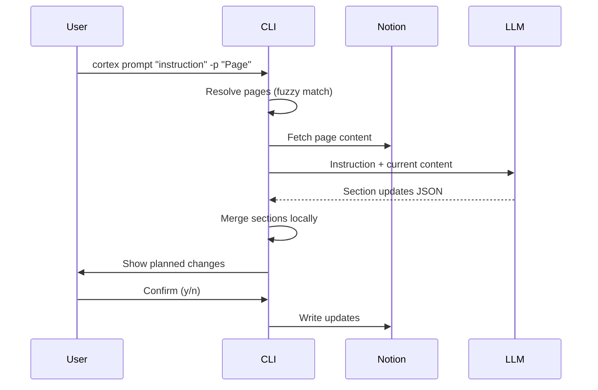

# CLI Reference

Codebase Cortex provides the `cortex` command-line tool for managing documentation sync between your codebase and Notion.

## Global Options

```bash
cortex --version    # Show version
cortex --help       # Show help
```

---

## `cortex init`

Interactive setup wizard. Run this inside your project repository.

```bash
cd /path/to/your-project
cortex init
```

### What it does



1. **LLM provider** — Choose between Google Gemini, Anthropic, or OpenRouter
2. **API key** — Enter the API key for your chosen provider
3. **Model** — Select from recommended models or enter a custom model name
4. **GitHub token** — Optional, only needed for private remote repos
5. **Config** — Creates `.cortex/` directory with `.env` file
6. **Git hook** — Optionally installs a `post-commit` hook that runs Cortex automatically
7. **Notion OAuth** — Opens browser for Notion authorization (OAuth 2.0 + PKCE)
8. **Starter pages** — Creates initial documentation pages in Notion

### Files created

```
.cortex/
├── .env                    # Configuration and API keys
├── .gitignore              # Ignores all .cortex/ contents
├── notion_tokens.json      # OAuth tokens
└── page_cache.json         # Tracked page metadata
```

### Re-initialization

Running `cortex init` when `.cortex/` already exists will prompt for confirmation before overwriting.

---

## `cortex run`

Run the full agent pipeline.

```bash
cortex run [OPTIONS]
```

### Options

| Option | Description |
|--------|-------------|
| `--once` | Run once and exit (default behavior) |
| `--watch` | Watch for changes continuously (not yet implemented) |
| `--dry-run` | Analyze without writing to Notion |
| `--full` | Analyze entire codebase, not just recent diff |
| `-v, --verbose` | Enable debug logging (LLM calls, MCP calls) |

### Examples

```bash
# Standard run — analyze recent commit, update Notion
cortex run --once

# First-time full scan — documents entire codebase
cortex run --once --full

# Preview what would be updated
cortex run --once --dry-run

# Debug mode — see all LLM and MCP calls
cortex run --once -v
```

### First-run detection

On the first run after `cortex init`, Cortex automatically detects that pages have no content yet and switches to `--full` mode to scan the entire codebase.

### Pipeline stages



### Output

The CLI displays results in styled panels:

- **Analysis** — Code change analysis
- **Related Docs** — Semantically related code chunks
- **Doc Updates** — Pages created or updated in Notion
- **Tasks Created** — Documentation tasks with priorities
- **Sprint Summary** — Weekly activity report

---

## `cortex prompt`

Send a natural language instruction to update Notion pages.

```bash
cortex prompt INSTRUCTION [OPTIONS]
```

### Arguments

| Argument | Description |
|----------|-------------|
| `INSTRUCTION` | Natural language instruction (required) |

### Options

| Option | Description |
|--------|-------------|
| `-p, --page TEXT` | Target page(s) to update. Repeatable. Auto-detects if omitted. |
| `--dry-run` | Show planned changes without writing |
| `-v, --verbose` | Enable debug logging |

### Examples

```bash
# Auto-detect which pages to update
cortex prompt "Add more code examples to all documentation"

# Target a specific page
cortex prompt "Add error handling section" -p "API Reference"

# Target multiple pages
cortex prompt "Update for v2 migration" -p "Architecture Overview" -p "API Reference"

# Preview without writing
cortex prompt "Expand the auth docs" --dry-run
```

### How it works



1. **Resolve pages** — If `--page` is provided, fuzzy-matches against the page cache. If omitted, fetches all pages and lets the LLM decide which to update.
2. **Fetch content** — Retrieves current page content from Notion
3. **Generate updates** — LLM receives the instruction and current content, returns section-level updates
4. **Preview** — Shows a summary of planned changes (page names and affected sections)
5. **Confirm** — Asks for user confirmation before writing
6. **Write** — Merges and writes updated content to Notion

### Page matching

Page names are matched using fuzzy matching that:
- Strips emojis and special characters
- Is case-insensitive
- Collapses whitespace

So `"api reference"`, `"API Reference"`, and `"📚 API Reference"` all match the same page.

---

## `cortex status`

Show connection status and workspace info.

```bash
cortex status
```

### Output

Displays:
- Config file location
- LLM provider
- Repository path
- Notion connection status (token validity)
- FAISS index status
- MCP connection test (lists available tools)

---

## `cortex analyze`

One-shot diff analysis without writing to Notion.

```bash
cortex analyze
```

Analyzes the most recent git commit and displays the analysis. Useful for previewing what Cortex would do without connecting to Notion.

---

## `cortex embed`

Rebuild the FAISS embedding index for the current repo.

```bash
cortex embed
```

### What it does

1. Walks the repository and collects code chunks (functions, classes, modules)
2. Generates embeddings using sentence-transformers (all-MiniLM-L6-v2)
3. Builds a FAISS index and saves to `.cortex/faiss_index/`

### Supported file types

Python, JavaScript, TypeScript, Java, Go, Rust, C, C++, Ruby, PHP, Swift, Kotlin, Scala, shell scripts, SQL, HTML, CSS, YAML, JSON, TOML, Markdown, Dockerfiles, and more.

---

## `cortex scan`

Discover existing Notion pages and link them to Cortex.

```bash
cortex scan [OPTIONS]
```

### Options

| Option | Description |
|--------|-------------|
| `--query TEXT` | Search query to filter pages (default: repo name) |
| `--link TEXT` | Manually link a Notion page by URL or ID. Repeatable. |

### Examples

```bash
# Discover all pages matching repo name
cortex scan

# Search for specific pages
cortex scan --query "API documentation"

# Link a specific page by ID
cortex scan --link "abc123-def456-..."

# Link by Notion URL
cortex scan --link "https://notion.so/My-Page-abc123def456"
```

---

## Git Hook

During `cortex init`, you can optionally install a `post-commit` git hook. This runs Cortex automatically after each commit:

```bash
# Full mode — writes to Notion
cortex run --once --verbose >> .cortex/hook.log 2>&1 &

# Dry-run mode — logs only
cortex run --once --verbose --dry-run >> .cortex/hook.log 2>&1 &
```

The hook runs in the background (`&`) so it doesn't block your git workflow. Output is logged to `.cortex/hook.log`.

---

## Exit Codes

| Code | Meaning |
|------|---------|
| 0 | Success |
| 1 | Error (not initialized, LLM failure, MCP connection error) |

## Environment Variables

All configuration is stored in `.cortex/.env`. See [Configuration](configuration.md) for details.
