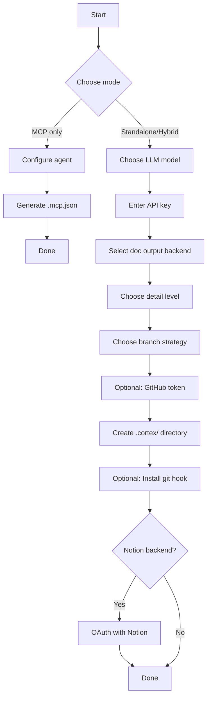
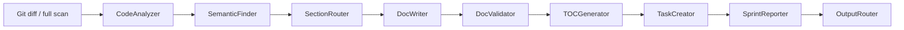
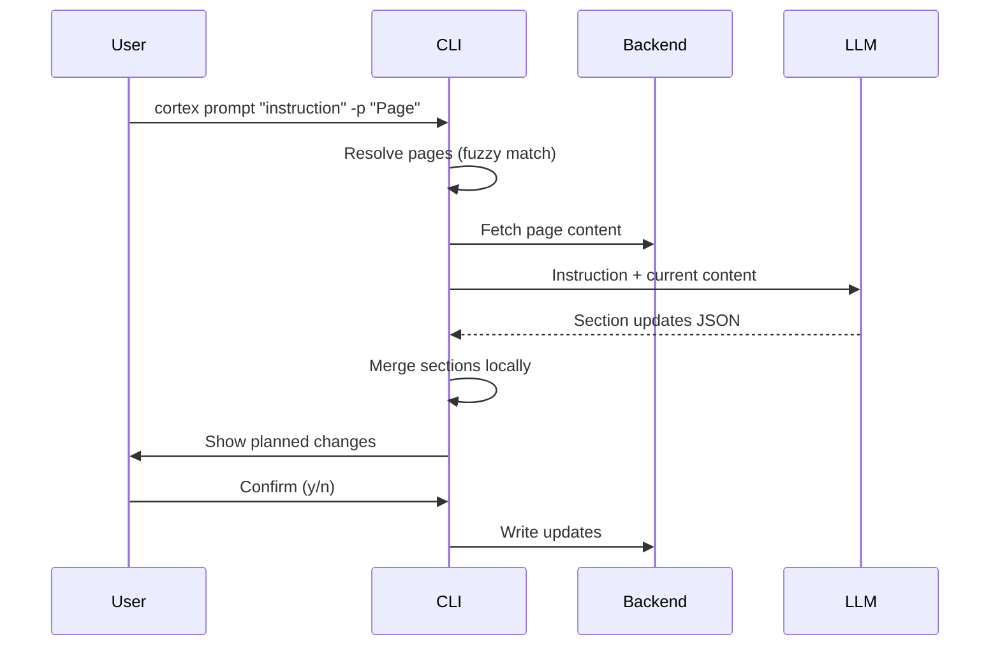

# CLI Reference


<!-- cortex:toc -->
- [Global Options](#global-options)
- [`cortex init`](#cortex-init)
  - [What it does](#what-it-does)
  - [Files created](#files-created)
  - [Re-initialization](#re-initialization)
- [`cortex run`](#cortex-run)
  - [Options](#options)
  - [Examples](#examples)
  - [First-run detection](#first-run-detection)
  - [Pipeline stages](#pipeline-stages)
  - [Output](#output)
- [`cortex status`](#cortex-status)
- [`cortex analyze`](#cortex-analyze)
- [`cortex embed`](#cortex-embed)
  - [Supported file types](#supported-file-types)
- [`cortex config`](#cortex-config)
  - [Examples](#examples-1)
- [`cortex accept`](#cortex-accept)
- [`cortex diff`](#cortex-diff)
- [`cortex apply`](#cortex-apply)
- [`cortex discard`](#cortex-discard)
- [`cortex resolve`](#cortex-resolve)
- [`cortex check`](#cortex-check)
- [`cortex sync`](#cortex-sync)
- [`cortex map`](#cortex-map)
- [`cortex prompt`](#cortex-prompt)
  - [Arguments](#arguments)
  - [Options](#options-1)
  - [Examples](#examples-2)
  - [How it works](#how-it-works)
  - [Page matching](#page-matching)
- [`cortex ci`](#cortex-ci)
  - [Options](#options-2)
  - [Modes](#modes)
  - [JSON output](#json-output)
  - [GitHub Actions example](#github-actions-example)
  - [GitLab CI example](#gitlab-ci-example)
- [`cortex mcp serve`](#cortex-mcp-serve)
- [`cortex scan`](#cortex-scan)
  - [Options](#options-3)
  - [Examples](#examples-3)
- [Git Hook](#git-hook)
- [Exit Codes](#exit-codes)
- [Environment Variables](#environment-variables)
<!-- cortex:toc:end -->

Codebase Cortex provides the `cortex` command-line tool for managing documentation sync between your codebase and your chosen doc backend (local Markdown or Notion).

After installing (`pip install codebase-cortex`), both `cortex` and `codebase-cortex` commands are available. All examples below use `cortex`, but `codebase-cortex` works identically.

## Global Options

```bash
cortex --version    # Show version
cortex --help       # Show help
```

---

## `cortex init`

Interactive setup wizard. Run this inside your project repository.

```bash
cd /path/to/your-project
cortex init
cortex init --quick   # Auto-detect from env, use defaults
```

### What it does

The init wizard first asks you to choose a mode:

- **MCP server only** — Sets up Cortex as an MCP server for coding agents. No LLM API key needed. Configures `.mcp.json` for your agent (Claude Code, Cursor, or Windsurf) and optionally appends Cortex tool descriptions to your project's `CLAUDE.md`.
- **Standalone pipeline** — Full LLM-powered pipeline that analyzes code and writes docs automatically.
- **Hybrid** — Both MCP server and standalone pipeline.

For standalone and hybrid modes, the wizard continues with:



1. **LLM model** -- Enter a model name in LiteLLM format (e.g. `gemini/gemini-2.5-flash-lite`, `anthropic/claude-sonnet-4-20250514`, `openrouter/meta-llama/llama-4-maverick`)
2. **API key** -- Enter the API key for your chosen provider
3. **Doc output backend** -- `local` (Markdown files in `docs/`) or `notion`
4. **Detail level** -- `standard`, `detailed`, or `comprehensive`
5. **Branch strategy** -- `main-only` (track main branch) or `branch-aware` (track all branches)
6. **GitHub token** -- Optional, only needed for private remote repos
7. **Config** -- Creates `.cortex/` directory with `.env` file
8. **Git hook** -- Optionally installs a `post-commit` hook that runs Cortex automatically
9. **Notion connection** -- If Notion backend is selected, opens browser for OAuth 2.0 + PKCE authorization

**Quick mode** (`--quick`) skips the interactive prompts. It auto-detects an API key from your shell environment (`GEMINI_API_KEY`, `GOOGLE_API_KEY`, `ANTHROPIC_API_KEY`, or `OPENROUTER_API_KEY`), defaults to the local backend, standard detail level, and main-only strategy.

### Files created

```
.cortex/
├── .env                    # Configuration and API keys
├── .gitignore              # Ignores all .cortex/ contents
├── notion_tokens.json      # OAuth tokens (if Notion backend)
└── page_cache.json         # Tracked page metadata (if Notion backend)
```

When using the local backend, documentation output goes to:

```
docs/
├── architecture-overview.md
├── api-reference.md
└── ...
```

### Re-initialization

Running `cortex init` when `.cortex/` already exists will prompt for confirmation before overwriting.

---

## `cortex run`

Run the full agent pipeline.

```bash
cortex run [OPTIONS]
```

### Options

| Option | Description |
|--------|-------------|
| `--once` | Run once and exit |
| `--full` | Analyze entire codebase, not just recent diff |
| `--dry-run` | Preview analysis without writing docs |
| `-v, --verbose` | Enable debug logging (LLM calls, backend writes) |

### Examples

```bash
# Standard run -- analyze recent commit, write docs
cortex run --once

# First-time full scan -- documents entire codebase
cortex run --once --full

# Preview what would be updated
cortex run --once --dry-run

# Debug mode
cortex run --once -v
```

### First-run detection

On the first run after `cortex init`, Cortex automatically detects that no documentation exists yet and switches to `--full` mode to scan the entire codebase.

### Pipeline stages



### Output

The CLI displays results in styled panels:

- **Analysis** -- Code change analysis
- **Related Docs** -- Semantically related code chunks
- **Doc Updates** -- Pages created or updated (local files or Notion)
- **Tasks Created** -- Documentation tasks with priorities
- **Sprint Summary** -- Weekly activity report

---

## `cortex status`

Show current configuration and documentation state.

```bash
cortex status
```

Displays:

- Config file location and settings
- Active doc backend (local or Notion)
- Detail level and branch strategy
- Number of tracked documentation pages
- Last pipeline run timestamp
- FAISS index status

---

## `cortex analyze`

One-shot diff analysis without writing documentation.

```bash
cortex analyze
```

Analyzes the most recent git commit and displays the analysis. Useful for previewing what Cortex sees before running the full pipeline.

---

## `cortex embed`

Rebuild the FAISS embedding index for the current repo.

```bash
cortex embed
```

Walks the repository, collects code chunks (functions, classes, modules), generates embeddings using sentence-transformers (all-MiniLM-L6-v2), and saves the FAISS index to `.cortex/faiss_index/`.

### Supported file types

Python, JavaScript, TypeScript, Java, Go, Rust, C, C++, Ruby, PHP, Swift, Kotlin, Scala, shell scripts, SQL, HTML, CSS, YAML, JSON, TOML, Markdown, Dockerfiles, and more.

---

## `cortex config`

View and update configuration values stored in `.cortex/.env`.

```bash
cortex config show               # Display all settings
cortex config set KEY VALUE      # Update a config value
```

### Examples

```bash
# View current config
cortex config show

# Switch to a different model
cortex config set LLM_MODEL "anthropic/claude-sonnet-4-20250514"

# Change detail level
cortex config set DOC_DETAIL_LEVEL comprehensive

# Switch output mode
cortex config set DOC_OUTPUT_MODE propose
```

---

## `cortex accept`

Remove draft banners from documentation files in `docs/` after human review.

```bash
cortex accept
```

When the pipeline writes new or updated docs, they include a draft banner indicating they were auto-generated. After reviewing the content, run `cortex accept` to strip the banners and mark the docs as reviewed.

---

## `cortex diff`

Show proposed documentation changes. Only relevant when `DOC_OUTPUT_MODE=propose`.

```bash
cortex diff
```

Displays a diff of all pending proposed changes stored in `.cortex/proposed/` against the current `docs/` files.

---

## `cortex apply`

Apply proposed documentation changes from `.cortex/proposed/` to `docs/`.

```bash
cortex apply
```

Moves proposed changes into the live documentation directory. Use after reviewing with `cortex diff`.

---

## `cortex discard`

Discard all pending proposed changes.

```bash
cortex discard
```

Removes everything in `.cortex/proposed/` without applying any changes.

---

## `cortex resolve`

Auto-resolve merge conflicts in documentation files.

```bash
cortex resolve
```

Scans `docs/` for git merge conflict markers and resolves them by keeping incoming changes. Useful after pulling or rebasing when docs have diverged.

---

## `cortex check`

Check documentation freshness against source code.

```bash
cortex check
```

Compares the last commit that touched each doc file against recent source commits to determine if any documentation is stale. Reports which docs need updating and how far behind they are.

---

## `cortex sync`

Sync local `docs/` to an external backend.

```bash
cortex sync --target notion
```

Pushes local Markdown documentation to Notion. Triggers OAuth authorization if not yet connected. Creates a parent page named after the repository and creates or updates child pages for each doc file.

---

## `cortex map`

Generate a knowledge map from the FAISS embedding index.

```bash
cortex map
```

Uses HDBSCAN clustering on the FAISS index to identify logical groupings of code. Outputs a visual map of how your codebase is organized by semantic similarity.

---

## `cortex prompt`

Send a natural language instruction to update documentation.

```bash
cortex prompt INSTRUCTION [OPTIONS]
```

### Arguments

| Argument | Description |
|----------|-------------|
| `INSTRUCTION` | Natural language instruction (required) |

### Options

| Option | Description |
|--------|-------------|
| `-p, --page TEXT` | Target page(s) to update. Repeatable. Auto-detects if omitted. |
| `--dry-run` | Show planned changes without writing |

### Examples

```bash
# Auto-detect which pages to update
cortex prompt "Add more code examples to all documentation"

# Target a specific page
cortex prompt "Add error handling section" -p "API Reference"

# Target multiple pages
cortex prompt "Update for v2 migration" -p "Architecture Overview" -p "API Reference"

# Preview without writing
cortex prompt "Expand the auth docs" --dry-run
```

### How it works



1. **Resolve pages** -- If `--page` is provided, fuzzy-matches against known doc pages. If omitted, scans all pages and lets the LLM decide which to update.
2. **Fetch content** -- Retrieves current page content from the active backend
3. **Generate updates** -- LLM receives the instruction and current content, returns section-level updates
4. **Preview** -- Shows a summary of planned changes (page names and affected sections)
5. **Confirm** -- Asks for user confirmation before writing
6. **Write** -- Merges and writes updated content to the backend

### Page matching

Page names are matched using fuzzy matching that:
- Strips emojis and special characters
- Is case-insensitive
- Collapses whitespace

So `"api reference"`, `"API Reference"`, and `"API Reference"` all match the same page.

---

## `cortex ci`

CI/CD mode for automated documentation updates. Designed to run inside GitHub Actions or GitLab CI pipelines.

```bash
cortex ci [OPTIONS]
```

### Options

| Option | Description |
|--------|-------------|
| `--on-pr` | Run doc impact analysis for a pull request (dry-run mode) |
| `--on-merge` | Generate doc updates after a merge to main |
| `--auto-apply` | Apply changes directly instead of proposing (use with `--on-merge`) |
| `--dry-run` | Preview only, write nothing |

### Modes

**PR analysis** (`--on-pr`): Runs the pipeline in dry-run mode and outputs a JSON summary of what documentation would change. Use this to post doc impact comments on pull requests.

**Post-merge update** (`--on-merge`): Runs the pipeline after code is merged to the main branch. By default, changes are staged in `.cortex/proposed/` for review. Add `--auto-apply` to write directly to `docs/`.

### JSON output

`cortex ci` outputs structured JSON for downstream CI steps:

```json
{
  "analysis": "Summary of code changes...",
  "doc_updates": [
    {"page": "architecture-overview.md", "action": "update", "sections": ["## API Layer"]}
  ],
  "tasks_created": [],
  "errors": [],
  "ci_context": {
    "provider": "github",
    "sha": "abc123",
    "base_ref": "main",
    "event": "pull_request",
    "pr_number": "42",
    "repo": "owner/repo"
  }
}
```

### GitHub Actions example

```yaml
name: Cortex Doc Sync
on:
  pull_request:
    branches: [main]
  push:
    branches: [main]

jobs:
  docs:
    runs-on: ubuntu-latest
    steps:
      - uses: actions/checkout@v4
        with:
          fetch-depth: 2  # Need parent commit for diff

      - uses: actions/setup-python@v5
        with:
          python-version: "3.11"

      - name: Install Cortex
        run: pip install codebase-cortex

      - name: Run Cortex
        env:
          GOOGLE_API_KEY: ${{ secrets.GOOGLE_API_KEY }}
        run: |
          if [ "${{ github.event_name }}" = "pull_request" ]; then
            cortex ci --on-pr > cortex-output.json
          else
            cortex ci --on-merge --auto-apply
          fi

      - name: Comment on PR
        if: github.event_name == 'pull_request'
        uses: actions/github-script@v7
        with:
          script: |
            const fs = require('fs');
            const output = JSON.parse(fs.readFileSync('cortex-output.json', 'utf8'));
            if (output.doc_updates.length > 0) {
              const pages = output.doc_updates.map(u => `- **${u.page}**: ${u.action}`).join('\n');
              await github.rest.issues.createComment({
                owner: context.repo.owner,
                repo: context.repo.repo,
                issue_number: context.issue.number,
                body: `## 📝 Documentation Impact\n\n${pages}\n\n<details>\n<summary>Analysis</summary>\n\n${output.analysis}\n</details>`
              });
            }

      - name: Commit doc updates
        if: github.event_name == 'push'
        run: |
          git config user.name "github-actions[bot]"
          git config user.email "github-actions[bot]@users.noreply.github.com"
          git add docs/
          git diff --cached --quiet || git commit -m "docs: auto-update from Cortex"
          git push
```

### GitLab CI example

```yaml
stages:
  - docs

cortex-docs:
  stage: docs
  image: python:3.11
  before_script:
    - pip install codebase-cortex
  script:
    - |
      if [ -n "$CI_MERGE_REQUEST_IID" ]; then
        cortex ci --on-pr
      else
        cortex ci --on-merge --auto-apply
        git config user.name "GitLab CI"
        git config user.email "ci@gitlab.com"
        git add docs/
        git diff --cached --quiet || git commit -m "docs: auto-update from Cortex"
        git push "https://gitlab-ci-token:${CI_JOB_TOKEN}@${CI_SERVER_HOST}/${CI_PROJECT_PATH}.git" HEAD:${CI_COMMIT_REF_NAME}
      fi
  rules:
    - if: $CI_MERGE_REQUEST_IID
    - if: $CI_COMMIT_BRANCH == $CI_DEFAULT_BRANCH
  variables:
    GOOGLE_API_KEY: $GOOGLE_API_KEY
```

---

## `cortex mcp serve`

Start the MCP (Model Context Protocol) server. This exposes 11 deterministic documentation tools over stdio for coding agents like Claude Code, Cursor, and Windsurf.

```bash
cortex mcp serve
```

The server requires a `.cortex/` directory (created by `cortex init`). No LLM API key is needed — the coding agent's own LLM does the thinking.

**Tools exposed:**

| Tool | Description |
|------|-------------|
| `cortex_search_related_docs` | Search FAISS index for code related to a query |
| `cortex_read_section` | Read a specific section from a doc page |
| `cortex_write_section` | Write/update a section (respects human edits) |
| `cortex_list_docs` | List all documentation pages with metadata |
| `cortex_check_freshness` | Check if docs are stale vs source code |
| `cortex_get_doc_status` | Get detailed status for a specific doc page |
| `cortex_rebuild_index` | Rebuild the FAISS embedding index |
| `cortex_accept_drafts` | Remove draft banners from reviewed docs |
| `cortex_create_page` | Create a new documentation page |
| `cortex_knowledge_map` | Generate knowledge map from FAISS clusters |
| `cortex_sync` | Sync local docs to Notion (requires prior OAuth) |

**Agent configuration:**

Add to your project's `.mcp.json`:

```json
{
  "mcpServers": {
    "cortex": {
      "command": "cortex",
      "args": ["mcp", "serve"]
    }
  }
}
```

See [MCP Server documentation](mcp-server.md) for full setup instructions and agent-specific configs.

---

## `cortex scan`

Discover and link Notion pages to Cortex.

```bash
cortex scan [OPTIONS]
```

### Options

| Option | Description |
|--------|-------------|
| `--query TEXT` | Search query to filter pages (default: repo name) |
| `--link TEXT` | Manually link a Notion page by URL or ID. Repeatable. |

### Examples

```bash
# Discover all pages matching repo name
cortex scan

# Search for specific pages
cortex scan --query "API documentation"

# Link a specific page by ID
cortex scan --link "abc123-def456-..."

# Link by Notion URL
cortex scan --link "https://notion.so/My-Page-abc123def456"
```

---

## Git Hook

During `cortex init`, you can optionally install a `post-commit` git hook. This runs Cortex automatically after each commit:

```bash
cortex run --once --verbose >> .cortex/hook.log 2>&1 &
```

The hook runs in the background (`&`) so it doesn't block your git workflow. Output is logged to `.cortex/hook.log`.

---

## Exit Codes

| Code | Meaning |
|------|---------|
| 0 | Success |
| 1 | Error (not initialized, LLM failure, backend connection error) |

## Environment Variables

All configuration is stored in `.cortex/.env`:

| Variable | Description |
|----------|-------------|
| `LLM_MODEL` | Model in LiteLLM format (e.g. `gemini/gemini-2.5-flash-lite`) |
| `LLM_API_KEY` | API key for the configured model's provider |
| `GEMINI_API_KEY` | Google Gemini API key (alternative to `LLM_API_KEY`) |
| `GOOGLE_API_KEY` | Google API key (alternative to `GEMINI_API_KEY`) |
| `ANTHROPIC_API_KEY` | Anthropic API key (alternative to `LLM_API_KEY`) |
| `OPENROUTER_API_KEY` | OpenRouter API key (alternative to `LLM_API_KEY`) |
| `DOC_OUTPUT` | Doc backend: `local` or `notion` |
| `DOC_DETAIL_LEVEL` | `standard`, `detailed`, or `comprehensive` |
| `DOC_STRATEGY` | `main-only` or `branch-aware` |
| `DOC_OUTPUT_MODE` | `apply`, `propose`, or `dry-run` |
| `DOC_SCOPE` | Optional monorepo scope path |
| `MCP_SERVER_ENABLED` | Enable MCP server mode (`true`/`false`) |
| `MCP_AGENT` | Configured coding agent (`claude-code`, `cursor`, `windsurf`) |
| `GITHUB_TOKEN` | GitHub personal access token (optional) |

See [Configuration](configuration.md) for details.
