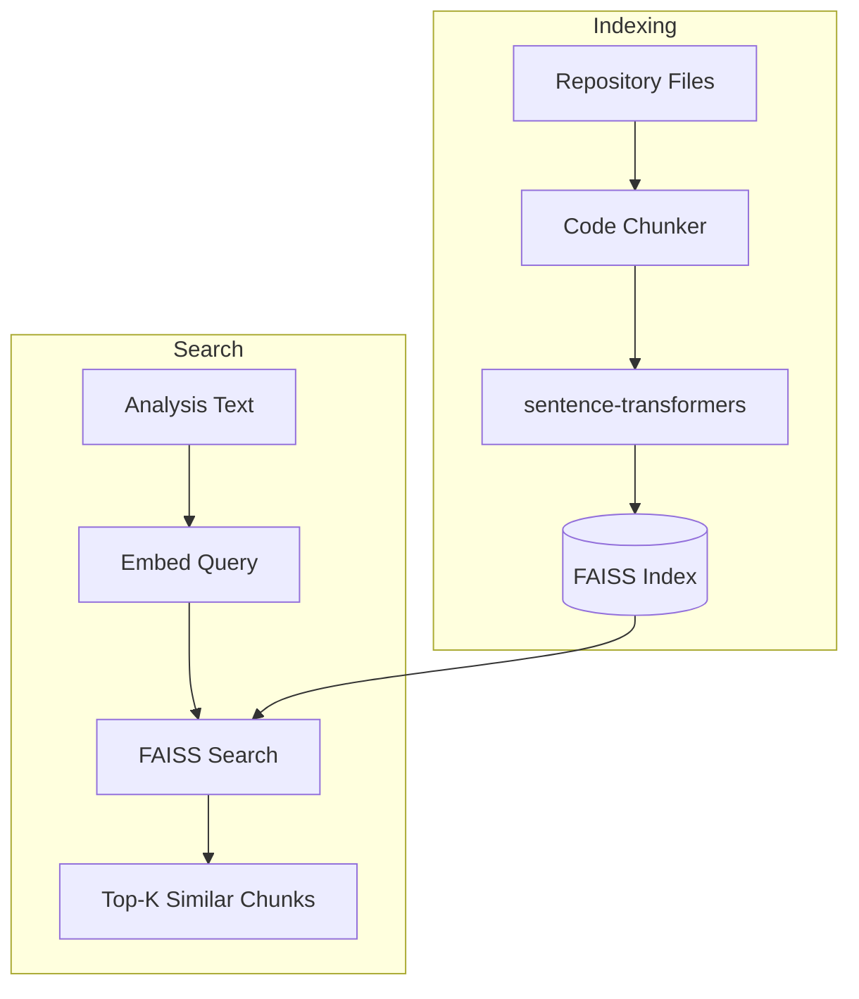
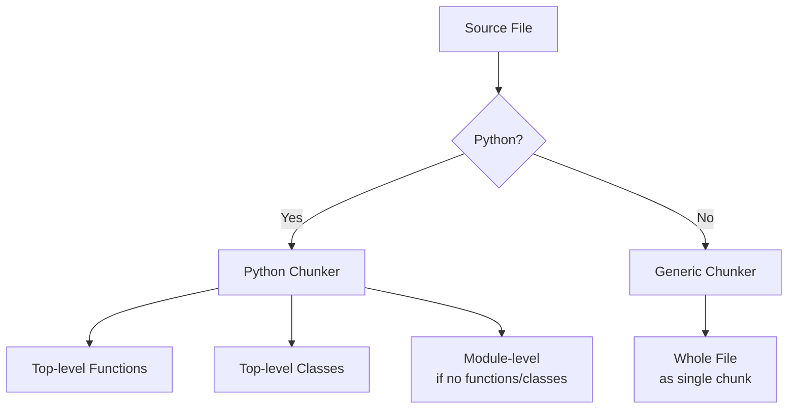

# Embeddings & Semantic Search

Codebase Cortex uses vector embeddings to find code that is semantically related to documentation changes. This enables the pipeline to update relevant docs even when file paths don't directly match.

## Overview



## Code Chunking

The `EmbeddingIndexer` walks your repository and extracts meaningful code chunks for embedding.

### Chunking strategy



**Python files** are chunked by:
- Top-level function definitions (regex: `^def \w+`)
- Top-level class definitions (regex: `^class \w+`)
- If no functions or classes are found, the whole file is treated as a module

**Non-Python files** are treated as a single "module" chunk (truncated to 3,000 characters).

### Chunk representation

Each chunk becomes a text string for embedding:

```
[function] path/to/file.py::function_name
def function_name(arg1, arg2):
    """Docstring here."""
    implementation...
```

The format includes the chunk type, file path, name, and full content.

### Supported file types

Cortex indexes files with these extensions:

| Category | Extensions |
|----------|-----------|
| Python | `.py` |
| JavaScript/TypeScript | `.js`, `.jsx`, `.ts`, `.tsx` |
| JVM | `.java`, `.kt`, `.scala` |
| Systems | `.c`, `.cpp`, `.h`, `.hpp`, `.rs`, `.go` |
| Scripting | `.rb`, `.php`, `.swift` |
| Web | `.html`, `.css`, `.scss` |
| Data/Config | `.json`, `.yaml`, `.yml`, `.toml` |
| Database | `.sql` |
| Shell | `.sh`, `.bash`, `.zsh` |
| Docs | `.md`, `.rst` |
| Containers | `Dockerfile` |

### Excluded directories

These directories are always skipped:

```
.git, node_modules, __pycache__, .pytest_cache, venv, .venv,
env, .env, build, dist, .tox, .mypy_cache, .ruff_cache,
.eggs, *.egg-info, .cortex
```

### File size limit

Files larger than **100KB** are skipped to avoid embedding very large generated files.

## Embedding Model

Cortex uses **all-MiniLM-L6-v2** from sentence-transformers:

| Property | Value |
|----------|-------|
| Model | all-MiniLM-L6-v2 |
| Dimensions | 384 |
| Max sequence length | 256 tokens |
| Size | ~80MB |
| Speed | Fast (CPU-friendly) |

The model is lazy-loaded on first use. On the first run, it downloads from Hugging Face Hub (~80MB).

### Embedding generation

```python
from sentence_transformers import SentenceTransformer

model = SentenceTransformer("all-MiniLM-L6-v2")
embeddings = model.encode(texts, show_progress_bar=True)
# Returns: numpy array of shape (n_chunks, 384)
```

## FAISS Index

### Index type

Cortex uses `IndexFlatL2` — a flat (brute-force) index with L2 (Euclidean) distance:

- **Exact search** — No approximation, always finds the true nearest neighbors
- **Best for small-medium codebases** — Up to ~100K chunks with sub-second search
- **No training required** — Index can be built in a single pass

### Storage

The index is persisted in `.cortex/faiss_index/`:

| File | Contents |
|------|----------|
| `index.faiss` | Binary FAISS index (vectors) |
| `chunks.json` | Metadata for each chunk (file path, type, name, content preview) |

### Similarity scoring

FAISS returns L2 distances. Cortex converts these to similarity scores:

```
score = 1 / (1 + distance)
```

- Score of **1.0** = identical
- Score of **0.5** = distance of 1.0
- Results are sorted by score (highest first)

### Search parameters

| Parameter | Value | Description |
|-----------|-------|-------------|
| `k` | 10 | Number of nearest neighbors to return |
| Metric | L2 | Euclidean distance |

## HDBSCAN Clustering

Cortex includes topic clustering using [HDBSCAN](https://hdbscan.readthedocs.io/) for Knowledge Map generation.

### How it works


HDBSCAN is a density-based clustering algorithm that:
- **Automatically determines** the number of clusters
- **Handles noise** — unclustered chunks are labeled as noise (cluster_id = -1) and excluded
- **No fixed k** — Unlike k-means, you don't need to specify the number of clusters

### Configuration

| Parameter | Default | Description |
|-----------|---------|-------------|
| `min_cluster_size` | 3 | Minimum points to form a cluster |
| `min_samples` | 2 | Controls cluster density |
| Metric | Euclidean | Distance metric |

### Knowledge Map output

The clustering output is formatted as a markdown Knowledge Map:

```markdown
# Knowledge Map

> 45 code chunks across 8 topics

## auth: login, verify_token, hash_password
**Files:**
- src/auth/login.py
- src/auth/tokens.py
- src/auth/passwords.py
**Chunks:** 5

## api: routes, handlers, middleware
**Files:**
- src/api/routes.py
- src/api/handlers.py
**Chunks:** 4
```

### Topic labels

Labels are generated automatically from the most common directory path and the names of the chunks in each cluster:

```
label = "directory: chunk_name1, chunk_name2, chunk_name3"
```

## Rebuilding the Index

### Automatic

The FAISS index is rebuilt automatically on each `cortex run` to capture code changes.

### Manual

```bash
cortex embed
```

This walks the repo, generates embeddings, and saves the index. Output:

```
Indexing /path/to/your-project...
Found 234 code chunks
Generating embeddings...
Saved FAISS index with 234 vectors to .cortex/faiss_index/
```

## Performance Characteristics

| Metric | Value |
|--------|-------|
| Chunking | ~1 second for 1,000 files |
| Embedding | ~5 seconds for 500 chunks (CPU) |
| FAISS build | < 1 second for 10,000 vectors |
| FAISS search | < 1ms for 10,000 vectors |
| Total (embed command) | ~10 seconds for a medium project |

The embedding model runs on CPU by default. GPU acceleration is available if PyTorch has CUDA support, but is not required.
