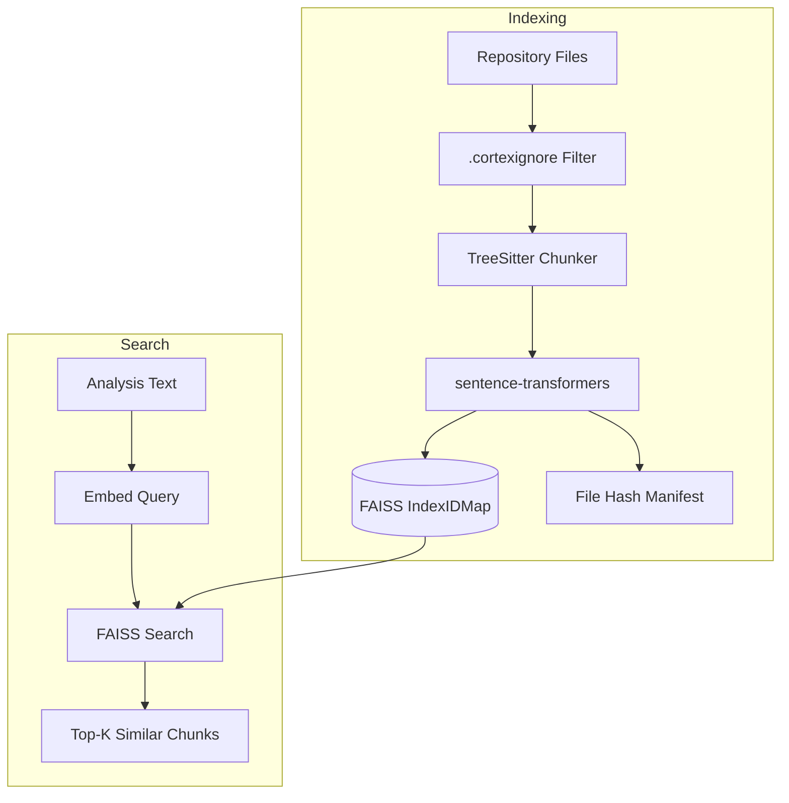
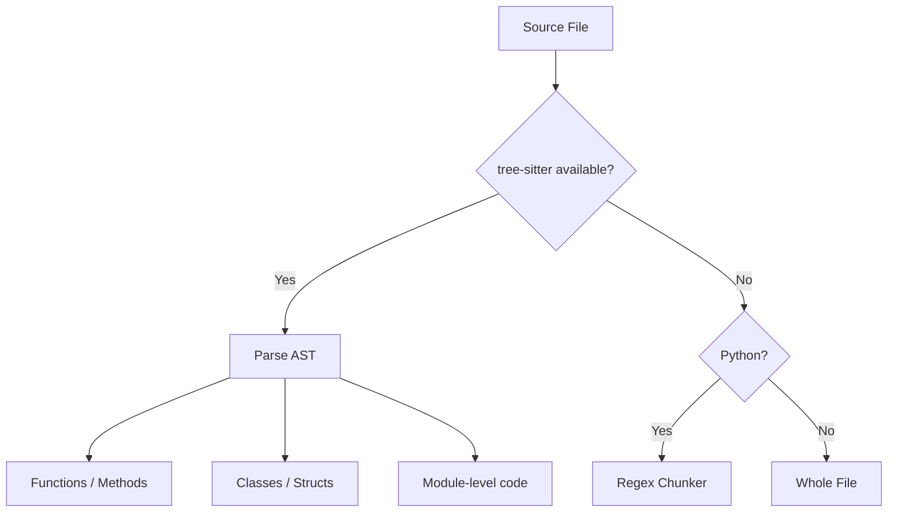

# Embeddings & Semantic Search


<!-- cortex:toc -->
- [Overview](#overview)
- [Code Chunking](#code-chunking)
  - [TreeSitter chunking](#treesitter-chunking)
  - [Fallback chunking](#fallback-chunking)
  - [Chunk representation](#chunk-representation)
  - [Supported languages (TreeSitter)](#supported-languages-treesitter)
  - [Supported file types](#supported-file-types)
  - [Excluded directories](#excluded-directories)
  - [.cortexignore](#cortexignore)
  - [File size limit](#file-size-limit)
- [Embedding Model](#embedding-model)
  - [Embedding generation](#embedding-generation)
- [FAISS Index](#faiss-index)
  - [Index type](#index-type)
  - [Storage](#storage)
  - [Incremental indexing](#incremental-indexing)
  - [ID management](#id-management)
  - [Similarity scoring](#similarity-scoring)
  - [Search parameters](#search-parameters)
- [HDBSCAN Clustering](#hdbscan-clustering)
  - [How it works](#how-it-works)
  - [Configuration](#configuration)
  - [Knowledge Map output](#knowledge-map-output)
  - [Topic labels](#topic-labels)
- [Rebuilding the Index](#rebuilding-the-index)
  - [Automatic (incremental)](#automatic-incremental)
  - [Manual](#manual)
- [Performance Characteristics](#performance-characteristics)
<!-- cortex:toc:end -->

Codebase Cortex uses vector embeddings to find code that is semantically related to documentation changes. This enables the pipeline to update relevant docs even when file paths don't directly match.

## Overview



## Code Chunking

Cortex uses AST-aware code chunking via tree-sitter for supported languages, with fallback strategies when tree-sitter is unavailable.

### TreeSitter chunking

The `TreeSitterChunker` (powered by the `tree-sitter-languages` package) parses source files into their AST and extracts meaningful code units:



Tree-sitter chunking extracts:
- Top-level function and method definitions
- Class, struct, and type definitions
- Module-level code that doesn't belong to a function or class

### Fallback chunking

When tree-sitter is not available for a given language:

- **Python files** fall back to regex-based chunking:
  - Top-level function definitions (regex: `^def \w+`)
  - Top-level class definitions (regex: `^class \w+`)
  - If no functions or classes are found, the whole file is treated as a module

- **All other files** are treated as a single "module" chunk (truncated to 3,000 characters).

### Chunk representation

Each chunk becomes a text string for embedding:

```
[function] path/to/file.py::function_name
def function_name(arg1, arg2):
    """Docstring here."""
    implementation...
```

The format includes the chunk type, file path, name, and full content.

### Supported languages (TreeSitter)

The following languages have full AST-aware chunking via tree-sitter:

| Language | Extensions |
|----------|-----------|
| Python | `.py` |
| JavaScript | `.js`, `.jsx` |
| TypeScript | `.ts`, `.tsx` |
| Go | `.go` |
| Rust | `.rs` |
| Java | `.java` |
| Ruby | `.rb` |
| PHP | `.php` |
| C | `.c`, `.h` |
| C++ | `.cpp`, `.hpp` |

### Supported file types

Cortex indexes files with these extensions (languages without tree-sitter support use the fallback chunker):

| Category | Extensions |
|----------|-----------|
| Python | `.py` |
| JavaScript/TypeScript | `.js`, `.jsx`, `.ts`, `.tsx` |
| JVM | `.java`, `.kt`, `.scala` |
| Systems | `.c`, `.cpp`, `.h`, `.hpp`, `.rs`, `.go` |
| Scripting | `.rb`, `.php`, `.swift` |
| Web | `.html`, `.css`, `.scss` |
| Data/Config | `.json`, `.yaml`, `.yml`, `.toml` |
| Database | `.sql` |
| Shell | `.sh`, `.bash`, `.zsh` |
| Docs | `.md`, `.rst` |
| Containers | `Dockerfile` |

### Excluded directories

These directories are always skipped:

```
.git, node_modules, __pycache__, .pytest_cache, venv, .venv,
env, .env, build, dist, .tox, .mypy_cache, .ruff_cache,
.eggs, *.egg-info, .cortex, docs
```

Note that `docs/` is included in the default skip list to prevent circular indexing of generated documentation.

### .cortexignore

In addition to the built-in exclusions, users can define custom exclusion patterns in `.cortex/.cortexignore`. This file uses gitignore-style syntax:

```
# Exclude vendored dependencies
vendor/
third_party/

# Exclude generated files
*.generated.*
*.min.js
```

The `.cortexignore` file is seeded with `docs/` on `cortex init` to prevent circular indexing.

### File size limit

Files larger than **100KB** are skipped to avoid embedding very large generated files.

## Embedding Model

Cortex uses **all-MiniLM-L6-v2** from sentence-transformers:

| Property | Value |
|----------|-------|
| Model | all-MiniLM-L6-v2 |
| Dimensions | 384 |
| Max sequence length | 256 tokens |
| Size | ~80MB |
| Speed | Fast (CPU-friendly) |

The model is lazy-loaded on first use. On the first run, it downloads from Hugging Face Hub (~80MB).

### Embedding generation

```python
from sentence_transformers import SentenceTransformer

model = SentenceTransformer("all-MiniLM-L6-v2")
embeddings = model.encode(texts, show_progress_bar=True)
# Returns: numpy array of shape (n_chunks, 384)
```

## FAISS Index

### Index type

Cortex uses `IndexIDMap(IndexFlatL2)` -- an ID-mapped flat index with L2 (Euclidean) distance:

- **Exact search** -- No approximation, always finds the true nearest neighbors
- **ID-based operations** -- Supports adding and removing chunks by ID, required for incremental rebuilds
- **Best for small-medium codebases** -- Up to ~100K chunks with sub-second search
- **No training required** -- Index can be built in a single pass

### Storage

The index is persisted in `.cortex/faiss_index/`:

| File | Contents |
|------|----------|
| `index.faiss` | Binary FAISS index (vectors with ID mapping) |
| `chunks.json` | Metadata for each chunk (file path, type, name, content preview) |
| `id_map.json` | Chunk ID to FAISS index mapping |
| `file_hashes.json` | File hash manifest for incremental rebuild tracking |

### Incremental indexing

Rather than rebuilding the entire index on every run, Cortex performs incremental updates:

1. **Hash comparison** -- Each file's content hash is compared against the manifest at `.cortex/faiss_index/file_hashes.json`
2. **Added/modified files** -- New or changed files are chunked, embedded, and added to the index
3. **Deleted files** -- Chunks belonging to removed files are deleted from the index via `remove_ids()`
4. **Unchanged files** -- Skipped entirely, preserving their existing embeddings

This significantly reduces indexing time for subsequent runs on large codebases.

### ID management

The `store.py` module manages the mapping between chunk IDs and FAISS index positions:

- `add()` -- Add new chunks with their embeddings
- `remove_ids()` -- Remove chunks by ID (used when files are deleted or modified)
- `get_chunk_ids_for_files()` -- Look up all chunk IDs belonging to a set of files

### Similarity scoring

FAISS returns L2 distances. Cortex converts these to similarity scores:

```
score = 1 / (1 + distance)
```

- Score of **1.0** = identical
- Score of **0.5** = distance of 1.0
- Results are sorted by score (highest first)

### Search parameters

| Parameter | Value | Description |
|-----------|-------|-------------|
| `k` | 10 | Number of nearest neighbors to return |
| Metric | L2 | Euclidean distance |

## HDBSCAN Clustering

Cortex includes topic clustering using [HDBSCAN](https://hdbscan.readthedocs.io/) for Knowledge Map generation.

### How it works


HDBSCAN is a density-based clustering algorithm that:
- **Automatically determines** the number of clusters
- **Handles noise** -- unclustered chunks are labeled as noise (cluster_id = -1) and excluded
- **No fixed k** -- Unlike k-means, you don't need to specify the number of clusters

### Configuration

| Parameter | Default | Description |
|-----------|---------|-------------|
| `min_cluster_size` | 3 | Minimum points to form a cluster |
| `min_samples` | 2 | Controls cluster density |
| Metric | Euclidean | Distance metric |

### Knowledge Map output

The clustering output is formatted as a markdown Knowledge Map:

```markdown
# Knowledge Map

> 45 code chunks across 8 topics

## auth: login, verify_token, hash_password
**Files:**
- src/auth/login.py
- src/auth/tokens.py
- src/auth/passwords.py
**Chunks:** 5

## api: routes, handlers, middleware
**Files:**
- src/api/routes.py
- src/api/handlers.py
**Chunks:** 4
```

### Topic labels

Labels are generated automatically from the most common directory path and the names of the chunks in each cluster:

```
label = "directory: chunk_name1, chunk_name2, chunk_name3"
```

## Rebuilding the Index

### Automatic (incremental)

The FAISS index is updated incrementally on each `cortex run`. Only files that have been added, modified, or deleted since the last run are processed.

### Manual

```bash
cortex embed
```

This walks the repo, generates embeddings, and saves the index. Output:

```
Indexing /path/to/your-project...
Found 234 code chunks
Generating embeddings...
Saved FAISS index with 234 vectors to .cortex/faiss_index/
```

## Performance Characteristics

| Metric | Value |
|--------|-------|
| Chunking (tree-sitter) | ~1 second for 1,000 files |
| Embedding | ~5 seconds for 500 chunks (CPU) |
| FAISS build | < 1 second for 10,000 vectors |
| FAISS search | < 1ms for 10,000 vectors |
| Incremental update | ~2 seconds for 50 changed files |
| Total (embed command) | ~10 seconds for a medium project |

The embedding model runs on CPU by default. GPU acceleration is available if PyTorch has CUDA support, but is not required.
