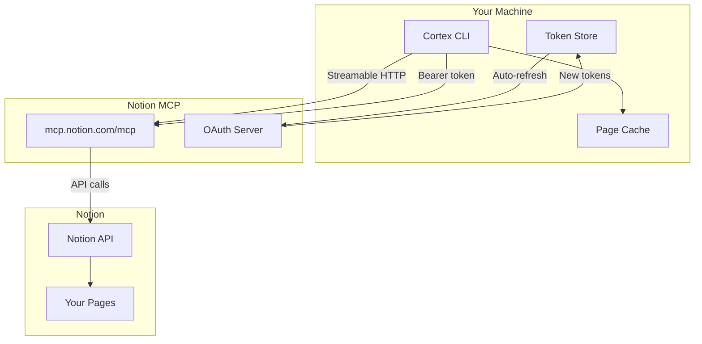
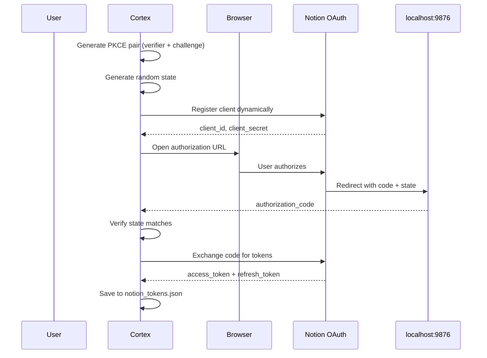
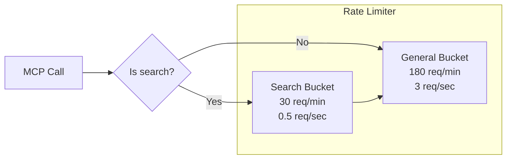
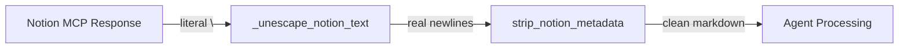

# Notion Integration

Codebase Cortex connects to Notion through the [Model Context Protocol (MCP)](https://developers.notion.com/docs/mcp), a standard protocol for AI tools to interact with services. This page covers the OAuth flow, MCP connection, page management, and rate limiting.

## Connection Architecture



## OAuth 2.0 + PKCE Flow

Cortex uses OAuth 2.0 with PKCE (Proof Key for Code Exchange) for secure authorization. No manual integration setup is needed — users just click "Allow" in the browser.

### Authorization flow



### Key details

| Parameter | Value |
|-----------|-------|
| OAuth server | `https://mcp.notion.com` |
| Authorization endpoint | `https://mcp.notion.com/authorize` |
| Token endpoint | `https://mcp.notion.com/token` |
| Client registration | `https://mcp.notion.com/register` |
| Callback URL | `http://localhost:9876/callback` |
| PKCE method | S256 (SHA-256) |
| Scope | Same as user's Notion account |

### Token refresh

- Access tokens expire after **1 hour**
- Refresh tokens are rotated (max **2 valid** at a time)
- Cortex auto-refreshes before each MCP session
- A 60-second buffer ensures tokens are refreshed before actual expiry

## MCP Connection

Cortex connects to the Notion MCP server using **Streamable HTTP** transport:

```python
# Connection URL
https://mcp.notion.com/mcp

# Transport
Streamable HTTP (via mcp library)

# Authentication
Authorization: Bearer <access_token>
```

### MCP Tools Used

Cortex uses these Notion MCP tools:

| Tool | Purpose | Rate Limit |
|------|---------|------------|
| `notion-fetch` | Read page content by ID | General (180/min) |
| `notion-update-page` | Update page content | General (180/min) |
| `notion-create-pages` | Create new pages | General (180/min) |
| `notion-search` | Search workspace | Search (30/min) |

### Tool call examples

**Reading a page:**
```json
{
  "tool": "notion-fetch",
  "arguments": { "id": "page-uuid" }
}
```

**Updating a page (replacing content):**
```json
{
  "tool": "notion-update-page",
  "arguments": {
    "page_id": "page-uuid",
    "command": "replace_content",
    "new_str": "# Page Title\n\nNew markdown content..."
  }
}
```

**Creating pages:**
```json
{
  "tool": "notion-create-pages",
  "arguments": {
    "pages": [
      {
        "properties": { "title": "New Page" },
        "content": "# New Page\n\nContent here..."
      }
    ],
    "parent": { "page_id": "parent-uuid" }
  }
}
```

**Appending to a page:**
```json
{
  "tool": "notion-update-page",
  "arguments": {
    "page_id": "page-uuid",
    "command": "insert_content_after",
    "new_str": "## New Section\n\nAppended content..."
  }
}
```

## Rate Limiting

Cortex implements a dual async token bucket to respect Notion's rate limits:



- **General**: 180 requests/minute (3/second) — applies to all calls
- **Search**: 30 requests/minute (0.5/second) — applies to `notion-search` calls
- Search calls consume from both buckets
- If a bucket is empty, the call waits until tokens replenish

## Page Management

### Starter pages

During `cortex init`, Cortex creates a set of starter documentation pages in Notion:

| Page | Purpose |
|------|---------|
| Codebase Cortex | Parent page (workspace root) |
| Architecture Overview | System design and component relationships |
| API Reference | API contracts and interfaces |
| Development Guide | Setup, workflow, and conventions |
| Task Board | Parent for task pages |
| Sprint Log | Weekly sprint summaries |

### Page cache

Cortex maintains a local cache of tracked pages (`.cortex/page_cache.json`) that maps page IDs to titles. This avoids:
- Searching the workspace on every run
- Overwriting unrelated user pages
- Redundant API calls

### Page discovery

Cortex discovers pages in several ways:

1. **Bootstrap** — Created during `cortex init`
2. **Child discovery** — Scans children of the parent page on each run
3. **Manual scan** — `cortex scan` searches the workspace
4. **Manual link** — `cortex scan --link <id>` links a specific page

### Title matching

When DocWriter looks up pages, it uses fuzzy matching:
- Strips emojis and special characters
- Case-insensitive comparison
- Normalizes whitespace

This means the LLM can reference "api reference" and it will match "API Reference" in the cache.

## Notion Content Encoding

The Notion MCP server has a quirk: `notion-fetch` returns page content with literal `\n` (backslash + n) instead of real newline characters. Cortex handles this transparently:



1. **`_unescape_notion_text()`** — Converts literal `\n` → real newline and `\t` → real tab
2. **`strip_notion_metadata()`** — Extracts content from the XML-like wrapper that `notion-fetch` returns

Writing content back via `notion-update-page` with `replace_content` works with real newlines — no special encoding needed.
